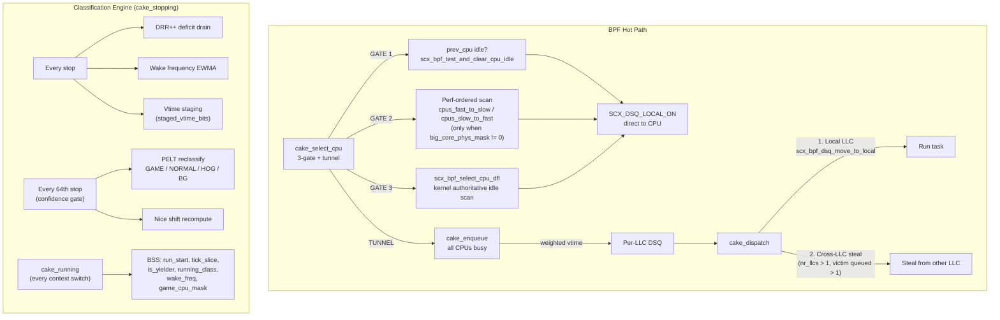
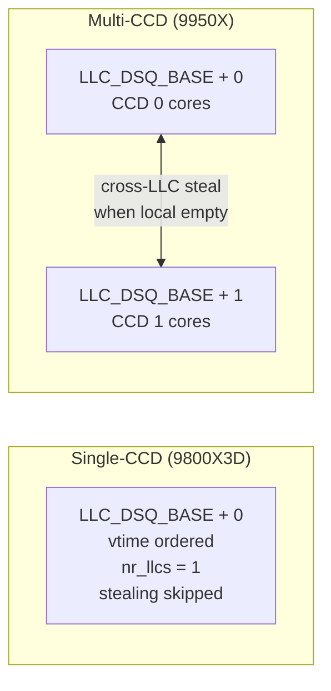
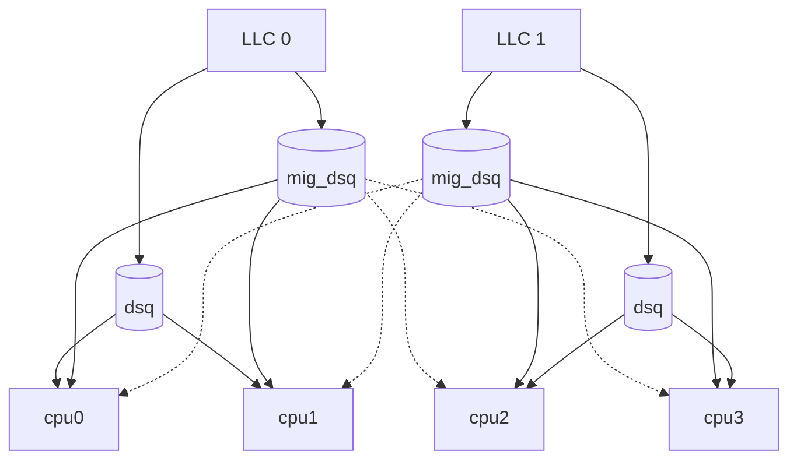

# scx_beerland

This is a single user-defined scheduler used within [`sched_ext`](https://github.com/sched-ext/scx/tree/main), which is a Linux kernel feature which enables implementing kernel thread schedulers in BPF and dynamically loading them. [Read more about `sched_ext`](https://github.com/sched-ext/scx/tree/main).

## Overview

scx_beerland (BPF-Enhanced Execution Runtime Locality-Aware Non-blocking
Dispatcher) is a scheduler designed to prioritize locality and scalability.

The scheduler uses separate DSQ (deadline ordered) for each CPU. Tasks get
a chance to migrate only on wakeup, when the system is not saturated. If
the system becomes saturated, CPUs also start pulling tasks from the remote
DSQs, always selecting the task with the smallest deadline.

## Typical Use Case

Cache-intensive workloads, systems with a large amount of CPUs.

## Production Ready?

Yes.

# scx_bpfland

This is a single user-defined scheduler used within [`sched_ext`](https://github.com/sched-ext/scx/tree/main), which is a Linux kernel feature which enables implementing kernel thread schedulers in BPF and dynamically loading them. [Read more about `sched_ext`](https://github.com/sched-ext/scx/tree/main).

## Overview

`scx_bpfland`: a vruntime-based `sched_ext` scheduler that prioritizes interactive
workloads.

This scheduler is derived from `scx_rustland`, but it is fully implemented in BPF.
It has a minimal user-space `Rust` part to process command line options, collect
metrics and log out scheduling statistics. The BPF part makes all the
scheduling decisions.

Tasks are categorized as either interactive or regular based on their average
rate of voluntary context switches per second. Tasks that exceed a specific
voluntary context switch threshold are classified as interactive. Interactive
tasks are prioritized in a higher-priority queue, while regular tasks are
placed in a lower-priority queue. Within each queue, tasks are sorted based on
their weighted runtime: tasks that have higher weight (priority) or use the CPU
for less time (smaller runtime) are scheduled sooner, due to their a higher
position in the queue.

Moreover, each task gets a time slice budget. When a task is dispatched, it
receives a time slice equivalent to the remaining unused portion of its
previously allocated time slice (with a minimum threshold applied). This gives
latency-sensitive workloads more chances to exceed their time slice when needed
to perform short bursts of CPU activity without being interrupted (i.e.,
real-time audio encoding / decoding workloads).

## Typical Use Case

Interactive workloads, such as gaming, live streaming, multimedia, real-time
audio encoding/decoding, especially when these workloads are running alongside
CPU-intensive background tasks.

In this scenario `scx_bpfland` ensures that interactive workloads maintain a high
level of responsiveness.

## Production Ready?

The scheduler is based on `scx_rustland`, implementing nearly the same scheduling
algorithm with minor changes and optimizations to be fully implemented in BPF.

Given that the `scx_rustland` scheduling algorithm has been extensively tested,
this scheduler can be considered ready for production use.

# scx_cake: CAKE DRR++ Adapted for CPU Scheduling

[](https://opensource.org/licenses/GPL-2.0)
[](https://kernel.org)
[](https://github.com/sched-ext/scx)

> **ABSTRACT**: `scx_cake` is an experimental BPF CPU scheduler that adapts the network [CAKE](https://www.bufferbloat.net/projects/codel/wiki/Cake/) algorithm's DRR++ (Deficit Round Robin++) for CPU scheduling. Designed for **gaming workloads** on modern AMD and Intel hardware.
>
> - **4-Class System** — Tasks classified as GAME / NORMAL / HOG / BG by PELT utilization and game family detection
> - **Zero Global Atomics** — Per-CPU BSS arrays with MESI-guarded writes eliminate bus locking
> - **3-Gate select_cpu** — prev_cpu idle → performance-ordered scan → kernel fallback → tunnel
> - **Per-LLC DSQ Sharding** — Eliminates cross-CCD lock contention on multi-chiplet CPUs
> - **EEVDF-Inspired Weighting** — Virtual runtime with sleep lag credit, nice scaling, and tiered DSQ ordering

---

> [!WARNING]
> **EXPERIMENTAL SOFTWARE**
> This scheduler is experimental and intended for use with `sched_ext` on Linux Kernel 6.12+. Performance may vary depending on hardware and user configuration.

> [!NOTE]
> **AI TRANSPARENCY**
> Large Language Models were used for optimization pattern matching and design exploration. All implementation details have been human-verified, benchmarked on real gaming workloads, and validated for correctness.

---

## Navigation

- [1. Quick Start](#1-quick-start)
- [2. Philosophy](#2-philosophy)
- [3. 4-Class System](#3-4-class-system)
- [4. Architecture](#4-architecture)
- [5. Configuration](#5-configuration)
- [6. Build Modes](#6-build-modes)
- [7. TUI Guide](#7-tui-guide)
- [8. Performance](#8-performance)
- [9. Vocabulary](#9-vocabulary)

---

## 1. Quick Start

```bash
# Prerequisites: Linux Kernel 6.12+ with sched_ext, Rust toolchain

# Clone and build
git clone https://github.com/sched-ext/scx.git
cd scx && cargo build --release -p scx_cake

# Run (requires root)
sudo ./target/release/scx_cake

# Run with live stats TUI
sudo scx_cake -v
```

---

## 2. Philosophy

Traditional schedulers (CFS, EEVDF) optimize for **fairness** — if a game and a compiler both run, each gets 50% CPU time. For gaming, this creates two problems:

1. **Latency inversion**: A 50µs input handler waits behind a 50ms compile job
2. **Frame jitter**: Game render threads get preempted mid-frame by background work

**scx_cake's answer**: Detect the game process family automatically (Steam, Wine/Proton, native games) and give it scheduling priority. Non-game tasks are classified by PELT CPU utilization into NORMAL, HOG, or BG classes with progressively lower priority. The system self-tunes — no manual configuration needed.

This is the same insight behind network CAKE: short flows (DNS, gaming packets) should not be delayed by bulk flows (downloads). scx_cake applies this to CPU time.

---

## 3. 4-Class System

`scx_cake` classifies every task into one of four classes. Classification uses PELT (Per-Entity Load Tracking) utilization from the kernel and automatic game family detection via process tree analysis.

### Class Hierarchy

| Class      | DSQ Weight Range | Typical Workload                                                     |
| :--------- | :--------------- | :------------------------------------------------------------------- |
| **GAME**   | [0, 5120]        | Game process tree + audio daemons + compositor (during GAMING state) |
| **NORMAL** | [8192, 13312]    | Default — interactive desktop tasks                                  |
| **HOG**    | [16384, 21504]   | High PELT utilization (≥78% CPU) non-game tasks                      |
| **BG**     | [49152, 54272]   | Low PELT utilization non-game tasks during GAMING                    |

> [!TIP]
> **Lower weight = dispatches first.** Non-overlapping weight ranges guarantee class ordering: all GAME tasks dispatch before any NORMAL task, all NORMAL before any HOG, etc.

### How Classification Works

1. **Game detection**: Two-phase detection scans for Steam environment variables and Wine `.exe` processes. Detected game TGIDs and their parent PID are written to BPF BSS. The entire process family (game + wineserver + audio + compositor) is promoted to GAME class.
2. **PELT-based classification**: Every 64th stop, the scheduler reads the kernel's `util_avg` for each task. Tasks with ≥78% CPU utilization are classified as HOG; lower-utilization non-game tasks become BG during GAMING state, or NORMAL otherwise.
3. **Audio/Compositor protection**: PipeWire daemons and Wayland compositors are detected at startup and baked into RODATA. During GAMING state, they receive GAME-level priority for latency parity with game threads.
4. **Waker-boost chain**: Tasks woken by GAME threads inherit GAME priority for one scheduling cycle. This automatically promotes game pipeline threads (sim→render→present) without explicit classification.

### Game Detection Deep Dive

Game detection runs in the **Rust TUI polling loop** (userspace, every refresh interval) and writes results to BPF BSS. The BPF side never scans `/proc` — it only reads the pre-resolved `game_tgid`, `game_ppid`, and `sched_state` from BSS.

**Detection Pipeline** (priority order):

1. **Phase 1 — Steam**: For each PPID group with ≥`GAME_MIN_THREADS` threads, read `/proc/<ppid>/environ` looking for `SteamGameId=` or `STEAM_GAME=`. If found, validate that the group contains a real game binary (not just `steam`, `steamwebhelper`, or `pressure-vessel`). Confidence: **100** (instant lock).
2. **Phase 2 — Wine/Proton .exe**: For remaining PPIDs with ≥`GAME_MIN_THREADS`, read `/proc/<ppid>/cmdline` looking for any argument ending in `.exe`. Covers Heroic Launcher, Lutris, manual Wine launches. Confidence: **90** (5-second holdoff).

**TGID Resolution**: Once a winning PPID is found, resolve the actual game TGID by:

- Building per-TGID max `pelt_util` across all threads in the PPID group
- Sorting TGIDs by descending PELT (the game's render loop consumes ms, infra exes consume µs)
- Filtering through a Windows infrastructure blocklist: `services.exe`, `winedevice.exe`, `pluginhost.exe`, `svchost.exe`, `explorer.exe`, `wineboot.exe`, `crashhandler.exe`, etc.
- Extracting the game name from `/proc/<tgid>/cmdline` (for `.exe`) or `/proc/<tgid>/comm` (for native)

**Hysteresis State Machine**:

- **Holdoff timer**: Lower-confidence candidates wait before locking (Steam=instant, .exe=5s). The same candidate must persist across multiple polls to lock.
- **Sticky incumbent**: Once locked, a game stays locked until its `/proc/<tgid>` disappears (process exits). A challenger can only displace it with **strictly higher** confidence.
- **Exit detection**: Every poll checks if `/proc/<game_tgid>` still exists. On exit → `tracked_game_tgid = 0`, `sched_state` transitions from GAMING → IDLE.

**BSS Propagation**: The resolved state is written to BPF BSS every refresh:

```
bss.game_tgid       = tracked_game_tgid    // for existence checks + display
bss.game_ppid       = tracked_game_ppid    // primary family signal for BPF classification
bss.game_confidence  = game_confidence      // 0/90/100
bss.sched_state      = IDLE | COMPILATION | GAMING
```

The BPF classification engine in `cake_init_task` and `cake_stopping` reads `game_ppid` to decide if a task belongs to the game family. All scheduling behavior changes (class assignment, DSQ weights, quantum caps, CPUPERF boost) flow from `sched_state`.

### DRR++ Deficit Tracking

Adapted from network CAKE's flow fairness:

- Each task starts with a **deficit** (quantum + new-flow bonus ≈ 10ms credit)
- Each execution bout consumes deficit proportional to runtime
- When deficit exhausts → new-flow bonus removed → task competes normally
- GAME tasks skip deficit drain entirely — their new-flow bonus persists forever

### EEVDF-Inspired Weighting

scx_cake uses a virtual runtime system inspired by EEVDF:

- **Sleep lag credit**: Tasks that yield voluntarily (game threads at vsync, audio callbacks) accumulate credit that reduces their DSQ weight on the next wakeup — dispatching them ahead of continuous consumers.
- **Nice scaling**: Per-task `nice_shift` (0-12) scales runtime cost. High `nice` priority → less vruntime cost → dispatches sooner. Computed once per 64 stops from `p->scx.weight`.
- **Capacity scaling**: On heterogeneous CPUs (P/E cores), E-core runtime is scaled by CPU capacity so tasks running on slower cores accumulate proportionally less vruntime.
- **CPUPERF steering**: During GAMING state, GAME tasks signal max CPU frequency boost (1024); non-GAME tasks use reduced boost (768). Check-before-write avoids redundant kfunc calls.

---

## 4. Architecture

### Overview



### Source Files

| File           | Lines  | Purpose                                                          |
| :------------- | :----- | :--------------------------------------------------------------- |
| `cake.bpf.c`   | ~3,300 | All BPF ops + classification engine + BenchLab                   |
| `intf.h`       | ~690   | Shared structs, constants, telemetry definitions                 |
| `bpf_compat.h` | ~38    | Relaxed atomics compatibility shim                               |
| `main.rs`      | ~750   | Rust loader, CLI, profiles, topology, audio/compositor detection |
| `topology.rs`  | ~270   | CPU topology detection (CCDs, P/E cores, V-Cache, SMT)           |
| `calibrate.rs` | ~305   | ETD inter-core latency measurement (CAS ping-pong)               |
| `tui.rs`       | ~4,500 | Terminal UI: debug view, live matrix, BenchLab, topology         |

### Ops Callbacks

| Callback                  | Role                                                       | Hot/Cold          |
| :------------------------ | :--------------------------------------------------------- | :---------------- |
| `cake_select_cpu`         | 3-gate idle CPU selection + kfunc tunneling                | **Hot**           |
| `cake_enqueue`            | Weighted vtime insert into per-LLC DSQ                     | **Hot**           |
| `cake_dispatch`           | Local LLC → cross-LLC steal                                | **Hot**           |
| `cake_running`            | BSS staging: run_start, is_yielder, game_cpu_mask, cpuperf | **Hot** (minimal) |
| `cake_stopping`           | Confidence-gated reclassification + DRR++ + vtime staging  | **Warm**          |
| `cake_yield`              | Yield count telemetry (stats-gated)                        | **Cold**          |
| `cake_runnable`           | Preempt count + wakeup source telemetry (stats-gated)      | **Cold**          |
| `cake_set_cpumask`        | Event-driven affinity update (replaces polling)            | **Cold**          |
| `cake_init_task`          | Arena + task_storage allocation, initial classification    | **Cold** (once)   |
| `cake_exit_task`          | Arena deallocation                                         | **Cold** (once)   |
| `cake_init` / `cake_exit` | DSQ creation, arena init, UEI                              | **Cold** (once)   |

### Data Structures

**Dual-storage architecture**:

- **`cake_task_hot`** (BPF task_storage, ~10ns lookup) — CL0 scheduling-critical fields used every stop: `task_class`, `deficit_u16`, `packed_info`, `warm_cpus`, `staged_vtime_bits`, `nice_shift`, `sleep_lag`, `cached_cpumask`
- **`cake_task_ctx`** (BPF Arena, ~29ns TLB walk) — Telemetry-only fields, gated behind `CAKE_STATS_ACTIVE`. Dead in release builds.
- **`cake_cpu_bss`** (BSS array, L1-cached) — Per-CPU hot fields: `run_start`, `tick_slice`, `is_yielder`, `cached_now`, `idle_hint`, `waker_boost`, `cached_perf`

**Per-CPU arena** (`cake_per_cpu`, conditional sizing):

- Release: 64B/CPU (CL0 only, 1 page total)
- Debug: 128B/CPU (CL0 + CL1 telemetry, 2 pages total)

### DSQ Architecture



- **Vtime encoding**: `now_cached + dsq_weight` — class weight ranges guarantee ordering (GAME always before NORMAL)
- **RODATA gate**: `if (nr_llcs <= 1) return;` skips all cross-LLC stealing on single-CCD systems

### Zero Global State

| Anti-pattern                | scx_cake                                      |
| :-------------------------- | :-------------------------------------------- |
| Global atomics              | **0** (except game_cpu_mask, transition-only) |
| Volatile variables          | **0**                                         |
| Division in hot path        | **0** (shift-based µs conversion: `>> 10`)    |
| Global vtime writes         | **0** (per-task only)                         |
| RCU lock/unlock in hot path | **0**                                         |

### Kfunc Tunneling

`select_cpu` caches `scx_bpf_now()` in per-CPU BSS (`cpu_bss[cpu].cached_now`). `enqueue` reuses this value, saving ~15ns (1 kfunc trampoline entry) on the all-busy path.

### VPROT: Preemption Protection

When a GAME task enters the DSQ during GAMING state and all CPUs are busy, `cake_enqueue` actively preempts a non-GAME task:

1. **O(1) victim finding**: `__builtin_ctzll(~game_cpu_mask)` — single `tzcnt` instruction (1 cycle on Zen 4). Bits set in `~game_cpu_mask` correspond to CPUs running non-GAME tasks.
2. **VPROT guard**: Before preempting, check if the victim has run long enough to justify interruption. The protection threshold is computed as:
   - **Base**: `tick_slice >> 4`, clamped to [125µs, 500µs]
   - **Per-class scaling**:
     - **NORMAL**: 75% (×3>>2) — useful interactive work, strong protection
     - **BG**: 50% (>>1) — background tasks, moderate protection
     - **HOG**: 25% (>>2) — bulk CPU consumers, minimal protection
3. **Preempt decision**: If `elapsed >= vprot_ns` → `scx_bpf_kick_cpu(victim, SCX_KICK_PREEMPT)`. Otherwise → suppressed (counted as `nr_vprot_suppressed` in stats).

This ensures GAME tasks never wait in the DSQ for a natural context switch while still protecting tasks from micro-slicing. The per-class scaling means HOG tasks (compilers, render farms) get preempted quickly while NORMAL desktop tasks get reasonable protection.

### Starvation Guard

The tiered DSQ weight system intrinsically prevents starvation:

- **Non-overlapping weight ranges** guarantee that within each class, tasks compete fairly on vtime (runtime cost determines ordering)
- **New-flow bonus** gives newly-woken tasks a vtime advantage, preventing permanent queue-back
- **Deficit drain** ensures long-running tasks lose their new-flow bonus and compete normally
- **Sleep lag credit** rewards voluntary yielders, preventing inversion where a yielding task falls behind a continuous consumer

The clock domain fix in `cake_running` (using `scx_bpf_now()` instead of `p->se.exec_start`) prevents a subtle starvation bug: after ~22 minutes, accumulated IRQ time drift in `exec_start` would exceed the u32 wrap boundary, corrupting elapsed-time checks and causing unconditional preemption (priority inversion).

### Scheduler States

The userspace TUI drives state machine transitions written to BPF BSS:

| State           | Value | Trigger                            | Effect                                   |
| :-------------- | :---- | :--------------------------------- | :--------------------------------------- |
| **IDLE**        | 0     | No game or compiler detected       | Baseline — NORMAL/HOG classes only       |
| **COMPILATION** | 1     | ≥2 compiler processes at ≥78% PELT | Cluster co-scheduling for build locality |
| **GAMING**      | 2     | Game detected (Steam/.exe/family)  | Full priority system: GAME/HOG/BG active |

### Loader Intelligence

The Rust loader (`main.rs`) performs significant one-time work at startup, baking results into BPF RODATA (immutable after load):

**Prefcore Ranking → Core Steering Arrays**:

- Reads `/sys/devices/system/cpu/cpu*/cpufreq/amd_pstate_prefcore_ranking` for each CPU
- Sorts by descending rank (fastest first), grouping SMT siblings together: `[best_phys, best_smt, second_phys, second_smt, ...]`
- Populates `cpus_fast_to_slow` (GAME scan order) and `cpus_slow_to_fast` (non-GAME scan order) in RODATA
- 0xFF sentinel terminates the array on CPUs without prefcore rankings

**Audio Stack Detection** (2-phase):

1. **Phase 1 — Comm scan**: Searches `/proc/*/comm` for known audio daemons: `pipewire`, `wireplumber`, `pipewire-pulse`, `pulseaudio`, `jackd`, `jackdbus`
2. **Phase 2 — PipeWire socket scan**: Reads `/proc/net/unix` to find the PipeWire socket inode (`/run/user/<uid>/pipewire-0`), then scans `/proc/*/fd` for processes holding a file descriptor to that inode. This catches audio mixer daemons (`goxlr-daemon`, `easyeffects`, etc.) without brittle comm lists.

- Up to 8 audio TGIDs baked into `audio_tgids[]` RODATA. During GAMING, BPF promotes matching tasks to GAME class.

**Compositor Detection**:

- Scans `/proc/*/comm` for known Wayland/X11 compositors: `kwin_wayland`, `kwin_x11`, `mutter`, `gnome-shell`, `sway`, `Hyprland`, `weston`, `labwc`, `wayfire`, `river`, `gamescope`
- Up to 4 compositor TGIDs baked into `compositor_tgids[]` RODATA. During GAMING, compositors receive GAME-level priority — essential for frame presentation latency parity.

**Topology Arrays**:

- `cpu_sibling_map[]` — SMT sibling pairs (Gate 2 class-mismatch filter)
- `cpu_llc_id[]` — Per-CPU LLC assignment (DSQ sharding)
- `llc_cpu_mask[]`, `core_cpu_mask[]` — Bitmask sets for LLC/core grouping
- `big_core_phys_mask`, `little_core_mask`, `vcache_llc_mask` — Intel hybrid + V-Cache topology

---

## 5. Configuration

### Profiles (`--profile, -p`)

| Profile     | Quantum | Starvation | Use Case                              |
| :---------- | :------ | :--------- | :------------------------------------ |
| **gaming**  | 2ms     | 100ms      | **(Default)** Balanced for most games |
| **esports** | 1ms     | 50ms       | Competitive FPS, ultra-low latency    |
| **legacy**  | 4ms     | 200ms      | Older CPUs, reduced overhead          |
| **battery** | 4ms     | 200ms      | Power-efficient for handhelds/laptops |
| **default** | 2ms     | 100ms      | Alias for gaming                      |

### CLI Arguments

| Argument                  | Default  | Description                             |
| :------------------------ | :------- | :-------------------------------------- |
| `--profile, -p <PROFILE>` | `gaming` | Select preset profile                   |
| `--quantum <µs>`          | profile  | Base time slice in microseconds         |
| `--new-flow-bonus <µs>`   | profile  | Extra deficit for newly woken tasks     |
| `--starvation <µs>`       | profile  | Max run time before forced preemption   |
| `--verbose, -v`           | `false`  | Enable live TUI stats display           |
| `--interval <secs>`       | `1`      | TUI refresh interval                    |
| `--testing`               | `false`  | Automated benchmarking mode (see below) |

### Testing Mode

`--testing` runs an automated benchmark for CI and regression testing:

1. **Warmup**: 1 second pause for the scheduler to stabilize
2. **Collection**: 10 seconds of operation, sampling per-CPU BSS dispatch counters
3. **Output**: Single-line JSON to stdout:

```json
{
  "duration_sec": 10.0,
  "total_dispatches": 1847263,
  "dispatches_per_sec": 184726.3
}
```

The scheduler exits automatically after printing. Requires a **debug build** (release builds silently ignore `--testing`). Useful for comparing scheduling throughput across code changes.

### Yield-Gated Quantum

Instead of per-tier multipliers, scx_cake uses a **yield-gated quantum** system:

- **Yielders** (cooperative tasks that voluntarily yield): Get full quantum ceiling (up to 2ms default)
- **Non-yielders** (bulk consumers): Get PELT-scaled slice, capped per class
- **GAME during GAMING**: 2x quantum ceiling (tasks yield at vsync, so they'll never consume it all)
- **HOG/BG during GAMING**: Halved caps (forces more preemption points for GAME tasks)

> [!NOTE]
> **Higher weight = dispatches later.** GAME [0-5120] dispatches before NORMAL [8192-13312] dispatches before HOG [16384-21504] dispatches before BG [49152-54272]. Within each class, PELT utilization and runtime cost provide fine-grained ordering.

### Examples

```bash
# Default gaming profile
sudo scx_cake

# Competitive gaming
sudo scx_cake -p esports

# Gaming with custom quantum and live stats
sudo scx_cake --quantum 1500 -v

# Battery-friendly for laptop gaming
sudo scx_cake -p battery
```

---

## 6. Build Modes

`scx_cake` has two build modes that control whether telemetry instrumentation is compiled into the BPF code.

### Release Mode (`cargo build --release`)

- `build.rs` passes `-DCAKE_RELEASE=1` to Clang
- **All `#ifndef CAKE_RELEASE` blocks are dead-code eliminated** — arena telemetry, per-task counters, gate hit tracking, BenchLab, and the entire `cake_task_ctx` arena struct are compiled out
- `CAKE_STATS_ENABLED` is a compile-time constant `0` — Clang eliminates all telemetry branches at BPF compile time
- Per-CPU arena blocks shrink from 128B (debug) to 64B (release)
- **TUI still works** but only shows aggregate BSS stats (gate latencies, dispatch counts). Per-task arena fields (gate hit %, callback durations, quantum breakdown) are unavailable

> [!TIP]
> Use `--release` for production gaming. The telemetry overhead is small (~2-5%), but eliminating it gives the tightest possible scheduling latency.

### Debug Mode (`cargo build`)

- `CAKE_RELEASE` is **not defined** — all telemetry code is compiled in
- `CAKE_STATS_ENABLED` becomes a volatile BSS read of `enable_stats`, controllable at runtime
- `CAKE_STATS_ACTIVE` = `CAKE_STATS_ENABLED && !bench_active` — telemetry is suppressed during BenchLab runs to avoid measuring measurement overhead
- Full per-task arena telemetry: gate hit counters, callback duration timers, quantum utilization, waker chain, LLC placement, dispatch gap tracking
- **Required for**: full TUI live matrix, BenchLab benchmarks, per-task gate analysis

```bash
# Production (release) — minimal overhead, limited TUI
cargo build --release -p scx_cake
sudo ./target/release/scx_cake -v

# Development (debug) — full telemetry, complete TUI
cargo build -p scx_cake
sudo ./target/debug/scx_cake -v
```

---

## 7. TUI Guide

The TUI is activated with `--verbose` / `-v` and provides real-time visibility into every scheduling decision. It requires a **debug build** for full per-task telemetry.

### Tabs

Navigate between tabs with `Tab` / `→` (next) and `Shift-Tab` / `←` (previous).

| Tab                 | Content                                                                                |
| :------------------ | :------------------------------------------------------------------------------------- |
| **Dashboard**       | Aggregate stats header + live task matrix with per-task scheduling data                |
| **Topology**        | CPU topology map: CCDs, P/E cores, V-Cache, SMT siblings, core-to-core latency heatmap |
| **BenchLab**        | In-kernel kfunc microbenchmarks: 60+ operations with ns-precision timing               |
| **Reference Guide** | Quick reference for column meanings, keybindings, and terminology                      |

### Dashboard: Aggregate Stats

The top section shows system-wide scheduling statistics aggregated from per-CPU BSS counters:

- **Gate hit rates**: Gate 1 (prev_cpu idle) %, Gate 2 (perf-ordered scan) %, Gate 3 (kernel fallback) %, Tunnel %
- **Dispatch stats**: DSQ queued, consumed, local dispatches, cross-LLC steals, dispatch misses
- **Flow stats**: New flow dispatches, old flow dispatches, DRR++ deficit activity
- **Game state**: Detected game name, TGID, PPID, thread count, sched_state (IDLE/COMPILATION/GAMING)
- **EEVDF stats**: Sleep lag applications, vprot suppression count, nice shift distribution

### Dashboard: Live Task Matrix

The scrollable table shows one row per task with these columns:

| Column     | Meaning                                                                             |
| :--------- | :---------------------------------------------------------------------------------- |
| **CPU**    | Last CPU the task ran on                                                            |
| **PID**    | Process ID                                                                          |
| **ST**     | Liveness: ●LIVE (BPF-tracked + running), ○IDLE (alive, no BPF data), ✗DEAD (exited) |
| **COMM**   | Task command name (from `/proc/PID/comm`)                                           |
| **CLS**    | Task class: GAME 🎮, NORM, HOG 🔥, BG                                               |
| **VCSW**   | Voluntary context switches (delta per interval)                                     |
| **AVGRT**  | Average runtime per execution bout (µs)                                             |
| **MAXRT**  | Maximum single-run duration (µs)                                                    |
| **GAP**    | Average dispatch gap — time between consecutive runs (µs)                           |
| **JITTER** | Scheduling jitter — variance in dispatch timing (µs)                                |
| **WAIT**   | Average wait time in DSQ before dispatch (µs)                                       |
| **RUNS/s** | Scheduling frequency — how often this task runs per second                          |
| **CPU**    | Current/last CPU placement (core ID)                                                |
| **SEL**    | `select_cpu` callback duration (ns)                                                 |
| **ENQ**    | `enqueue` callback duration (ns)                                                    |
| **STOP**   | `stopping` callback duration (ns)                                                   |
| **RUN**    | `running` callback duration (ns)                                                    |
| **G1**     | Gate 1 (prev_cpu idle) hit percentage for this task                                 |
| **G3**     | Gate 3 (kernel scan) hit percentage for this task                                   |
| **DSQ**    | DSQ tunnel (all busy) hit percentage                                                |
| **MIGR/s** | CPU migrations per second                                                           |
| **TGID**   | Thread Group ID (process leader PID)                                                |
| **Q%F**    | Quantum full — % of runs where task consumed entire time slice                      |
| **Q%Y**    | Quantum yield — % of runs where task yielded voluntarily                            |
| **Q%P**    | Quantum preempt — % of runs where task was preempted                                |
| **WAKER**  | PID of the last task that woke this task                                            |
| **NICE**   | Nice shift value (0-12) — EEVDF vruntime scaling factor                             |

Tasks are grouped by TGID (process) with collapsible headers. The detected game family is highlighted.

### Topology Tab

Displays the detected CPU topology in a visual format:

- **CCD map**: Which cores belong to which LLC/CCD
- **P/E core identification**: Big cores vs Little cores (Intel hybrid)
- **V-Cache detection**: Asymmetric LLC sizes across CCDs
- **SMT siblings**: Logical CPU pairs sharing a physical core
- **Core-to-core latency matrix**: Press `b` to run an ETD (Empirical Topology Discovery) benchmark measuring CAS ping-pong latency between every core pair. Results display as a color-coded heatmap.

### BenchLab Tab

In-kernel microbenchmark suite measuring the real cost of scheduling primitives:

- **60+ benchmarked operations**: kfunc trampolines, BSS reads, arena lookups, RODATA constants, data structure accesses, idle cascades, classification paths
- Each operation shows: **ID**, **Name**, **Category** (Data Read, Synchronization, Idle Selection, etc.), **Type** (K=kfunc, C=cake-internal), and **measured latency in nanoseconds**
- Press `b` to trigger a benchmark run (runs in-kernel, suppresses telemetry during measurement)
- Results persist across runs; press `c` to copy to clipboard for external analysis

### Keybindings

| Key               | Action                                                              |
| :---------------- | :------------------------------------------------------------------ |
| `q` / `Esc`       | Quit                                                                |
| `Tab` / `→`       | Next tab                                                            |
| `Shift-Tab` / `←` | Previous tab                                                        |
| `↑` / `↓`         | Scroll table / bench results                                        |
| `t`               | Jump to top of table                                                |
| `s`               | Cycle sort column (PID → PELT → Runs/s → CPU → Gate1% → ...)        |
| `S`               | Toggle sort direction (ascending ↔ descending)                      |
| `f`               | Toggle filter: BPF-tracked only ↔ all system tasks                  |
| `Enter`           | Collapse/expand PPID group (Dashboard)                              |
| `Space`           | Collapse/expand TGID group (Dashboard)                              |
| `x`               | Fold/unfold all PPID groups (Dashboard)                             |
| `c`               | Copy current tab data to clipboard                                  |
| `d`               | Dump full snapshot to timestamped file (`tui_dump_<epoch>.txt`)     |
| `r`               | Reset all BSS stats counters to zero                                |
| `b`               | Run benchmark (BenchLab on most tabs, core latency on Topology tab) |
| `+` / `=`         | Faster refresh rate (halve interval, min 250ms)                     |
| `-`               | Slower refresh rate (double interval, max 5000ms)                   |

### Data Export

Two export methods are available from any tab:

- **Clipboard** (`c`): Copies the current tab's data as formatted text. On Dashboard, includes aggregate stats + full task matrix. On BenchLab, includes all benchmark results with categories.
- **File dump** (`d`): Writes a complete snapshot to `tui_dump_<epoch>.txt` in the current working directory. Includes all stats, task matrix, and metadata. Useful for before/after comparisons or sharing with developers.

---

## 8. Performance

### Target Hardware

| Component | Specification                       |
| :-------- | :---------------------------------- |
| CPU       | AMD Ryzen 7 9800X3D (1 CCD, 8C/16T) |
| Kernel    | Linux 6.12+ with sched_ext          |

### Design Targets

- **Sub-microsecond scheduling decisions** — Select CPU + enqueue under 100ns typical
- **Zero bus lock contention** — No global atomics means no scaling regression under load
- **Consistent 1% lows** — Tiered weight system prevents frame time spikes from background work
- **Automatic game detection** — Two-phase Steam/Wine detection with holdoff hysteresis

### Benchmarks

- [schbench](https://github.com/brendangregg/schbench) — Scheduler latency microbenchmark
- Arc Raiders — AAA game stress testing (frame rates, 1% lows)
- Splitgate 2 — Competitive FPS latency testing

> [!NOTE]
> Throughput workloads (compilers, render farms) will perform **worse** than CFS/EEVDF. This scheduler explicitly trades throughput for latency — the same tradeoff network CAKE makes for packets.

### Comparison with Other sched_ext Schedulers

| Feature                 | scx_cake                            | scx_bpfland                    | scx_lavd                       | scx_cosmos                        |
| :---------------------- | :---------------------------------- | :----------------------------- | :----------------------------- | :-------------------------------- |
| **Primary goal**        | Gaming latency                      | General-purpose interactive    | Latency-sensitive workloads    | General-purpose + gaming          |
| **Task classification** | 4-class (GAME/NORMAL/HOG/BG)        | Interactive vs batch (2-class) | Urgency score (continuous)     | Latency criticality (multi-level) |
| **Game detection**      | Automatic (Steam/Wine/process tree) | None                           | Behavioral (latency patterns)  | None                              |
| **DSQ structure**       | Per-LLC vtime-ordered               | Per-LLC + shared               | Global ordered                 | Per-LLC                           |
| **Idle CPU selection**  | 3-gate custom + kernel fallback     | Kernel default                 | Custom idle scan               | Kernel default + LLC preference   |
| **EEVDF features**      | Sleep lag, nice scaling, vprot      | None                           | Urgency scoring                | None                              |
| **Core steering**       | Prefcore-aware (P/E, V-Cache)       | LLC-aware                      | LLC-aware                      | LLC-aware                         |
| **Global atomics**      | 0 (MESI-guarded BSS)                | Minimal                        | Some                           | Minimal                           |
| **When to choose**      | Gaming-first, multi-game families   | Desktop daily driver           | Mixed interactive + throughput | Desktop with gaming needs         |

> [!NOTE]
> scx_cake is **not** a general-purpose scheduler. It makes explicit tradeoffs that benefit gaming at the cost of throughput workloads. For daily desktop use without gaming, `scx_bpfland` or `scx_cosmos` may be better choices.

---

## 9. Vocabulary

### Core Concepts

| Term            | Definition                                                                                                                               |
| :-------------- | :--------------------------------------------------------------------------------------------------------------------------------------- |
| **CAKE**        | [Common Applications Kept Enhanced](https://www.bufferbloat.net/projects/codel/wiki/Cake/). Network AQM algorithm this scheduler adapts. |
| **DRR++**       | Deficit Round Robin++. Network algorithm balancing fair queuing with strict priority.                                                    |
| **PELT**        | Per-Entity Load Tracking. Kernel mechanism providing exponentially-decayed CPU utilization per task (`util_avg`).                        |
| **Class**       | Classification level (GAME/NORMAL/HOG/BG). Controls DSQ weight, quantum cap, and preemption policy.                                      |
| **Deficit**     | Per-task credit from DRR++. New tasks get bonus credit; GAME tasks skip deficit drain entirely.                                          |
| **Quantum**     | Base time slice a task is allotted before a scheduling decision.                                                                         |
| **Sleep Lag**   | EEVDF credit for voluntary yields. Reduces DSQ weight on next wakeup, so yielders dispatch first.                                        |
| **Waker Boost** | Transitive priority inheritance: tasks woken by GAME threads get GAME-level priority for one cycle.                                      |
| **Staged Bits** | Pre-computed scheduling state packed into a single u64 by `cake_stopping`, consumed by `cake_enqueue` to avoid redundant computation.    |
| **Jitter**      | Variance in scheduling latency between consecutive events. Low jitter = consistent frame delivery.                                       |

### Architecture

| Term                    | Definition                                                                                     |
| :---------------------- | :--------------------------------------------------------------------------------------------- |
| **Task Storage**        | BPF local storage attached to each task. 10ns lookup; holds CL0 hot scheduling fields.         |
| **Arena**               | BPF memory region for per-task telemetry data. 29ns TLB walk; dead in release builds.          |
| **BSS**                 | Zero-initialized BPF global data. Per-CPU arrays (`cpu_bss`) provide L1-cached hot fields.     |
| **Kfunc Tunneling**     | Caching kfunc return values in per-CPU BSS to avoid redundant trampoline calls.                |
| **MESI Guard**          | Read-before-write pattern: skip store if value unchanged, preventing cache invalidation.       |
| **RODATA Gate**         | Compile-time constant that eliminates entire code paths (e.g., single-CCD skips stealing).     |
| **Confidence Gate**     | Reclassification runs every 64th stop. 63/64 stops reuse cached task_class from task_storage.  |
| **BenchLab**            | In-kernel microbenchmark suite measuring kfunc costs, data access patterns, and gate cascades. |
| **Bitfield Coalescing** | Packing fields written together into adjacent bits for fused clear/set ops.                    |

### Hardware

| Term              | Definition                                                                                              |
| :---------------- | :------------------------------------------------------------------------------------------------------ |
| **CCD**           | Core Complex Die. Physical chiplet containing cores (9800X3D: 1 CCD, 9950X: 2 CCDs).                    |
| **LLC**           | Last Level Cache (L3). Cores in same LLC communicate ~3-5x faster than cross-LLC.                       |
| **SMT**           | Simultaneous Multi-Threading. Two logical CPUs per physical core.                                       |
| **P/E Cores**     | Intel hybrid architecture: Performance cores (fast) and Efficiency cores (power-saving).                |
| **V-Cache**       | AMD 3D V-Cache. Asymmetric LLC sizes across CCDs (e.g., 96MB vs 32MB on 9800X3D).                       |
| **ETD**           | Empirical Topology Discovery. Measures inter-core CAS latency at startup for display.                   |
| **Cache Line**    | 64-byte block of memory. Smallest unit the CPU loads from RAM. Foundation of data layout.               |
| **MESI Protocol** | Cache coherency protocol (Modified/Exclusive/Shared/Invalid). Unnecessary writes trigger invalidations. |

### Performance

| Term                | Definition                                                                              |
| :------------------ | :-------------------------------------------------------------------------------------- |
| **Hot Path**        | Code on every scheduling decision: select_cpu → enqueue → dispatch.                     |
| **Cold Path**       | Infrequent code: task init, reclassification (every 64th stop).                         |
| **Direct Dispatch** | `SCX_DSQ_LOCAL_ON` — task goes directly to a CPU's local queue, bypassing the DSQ path. |
| **1% Lows**         | Average framerate of the slowest 1% of frames. Key metric for stutter.                  |
| **Branchless**      | Code avoiding `if/else` to prevent CPU pipeline stalls from branch misprediction.       |

### Anti-Patterns

| Term                   | Definition                                                                                    |
| :--------------------- | :-------------------------------------------------------------------------------------------- |
| **False Sharing**      | Performance penalty when CPUs write to different data on the same 64-byte cache line.         |
| **Cache Invalidation** | Forcing other cores to discard cached data via unnecessary writes. Causes bus locking.        |
| **Micro-slicing**      | Preempting tasks too frequently. Queued interruptions degrade throughput and increase jitter. |
| **Volatile**           | Compiler hint preventing optimization. Clogs LSU, breaks ILP/MLP parallelism. Avoid in BPF.   |

---

**License**: GPL-2.0
**Maintainer**: RitzDaCat


A general purpose `sched_ext` scheduler designed to amplify race conditions for testing and debugging.

## Overview

`scx_chaos` is a specialized scheduler that intentionally introduces various forms of latency and performance degradation to help expose race conditions and timing-dependent bugs in applications. Unlike traditional schedulers that aim for optimal performance, `scx_chaos` is designed to stress-test applications by introducing controlled chaos into the scheduling process.

**WARNING**: This scheduler is experimental and should not be used in production environments. It is specifically designed to degrade performance and may cause system instability.

## Features

The scheduler supports several "chaos traits" that can be enabled individually or in combination, with more to come:

### Random Delays

- Introduces random delays in task scheduling
- Configurable frequency, minimum, and maximum delay times
- Helps expose timing-dependent race conditions

### CPU Frequency Scaling

- Randomly scales CPU frequency for processes
- Configurable frequency range and application probability
- Tests application behavior under varying CPU performance

### Performance Degradation

- Applies configurable performance degradation to processes
- Uses a fractional degradation system
- Simulates resource contention scenarios

### Kprobe-based Delays

- **WARNING**: These delays are the most likely to break your system
- Attaches to kernel functions via kprobes
- Introduces delays when specific kernel functions are called
- Useful for testing specific kernel code paths

## Usage

### Basic Usage

Run without chaos features (baseline performance):

```bash
sudo scx_chaos
```

### Random Delays

```bash
sudo scx_chaos --random-delay-frequency 0.1 --random-delay-min-us 100 --random-delay-max-us 1000
```

### CPU Frequency Scaling

```bash
sudo scx_chaos --cpufreq-frequency 0.2 --cpufreq-min 400000 --cpufreq-max 2000000
```

### Performance Degradation

```bash
sudo scx_chaos --degradation-frequency 0.15 --degradation-frac7 64
```

### Kprobe Delays

```bash
sudo scx_chaos --kprobes-for-random-delays schedule do_exit --kprobe-random-delay-frequency 0.05 --kprobe-random-delay-min-us 50 --kprobe-random-delay-max-us 500
```

### Testing Specific Applications

Run a specific command under the chaos scheduler:

```bash
sudo scx_chaos [chaos-options] -- ./your-application --app-args
```

The scheduler will automatically detach when the application exits.

### Process Targeting

Focus chaos on a specific process and its children:

```bash
sudo scx_chaos --pid 1234 [chaos-options]
```

### Monitoring

Enable statistics monitoring:

```bash
sudo scx_chaos --stats 1.0 [chaos-options]  # Update every 1 second
```

Run in monitoring mode only (no scheduler):

```bash
sudo scx_chaos --monitor 2.0
```

### Repeat Testing

Automatically restart applications for continuous testing:

```bash
# Restart on failure
sudo scx_chaos --repeat-failure [chaos-options] -- ./test-app

# Restart on success
sudo scx_chaos --repeat-success [chaos-options] -- ./test-app
```

## Command Line Options

> **Note:** For the most up-to-date and complete CLI documentation, run `scx_chaos --help`. This includes all chaos-specific options as well as the full set of p2dq performance tuning options.

### Random Delays

- `--random-delay-frequency <FLOAT>`: Probability of applying random delays (0.0-1.0)
- `--random-delay-min-us <MICROSECONDS>`: Minimum delay time
- `--random-delay-max-us <MICROSECONDS>`: Maximum delay time

### CPU Frequency

- `--cpufreq-frequency <FLOAT>`: Probability of applying frequency scaling
- `--cpufreq-min <FREQ>`: Minimum CPU frequency
- `--cpufreq-max <FREQ>`: Maximum CPU frequency

### Performance Degradation

- `--degradation-frequency <FLOAT>`: Probability of applying degradation
- `--degradation-frac7 <0-128>`: Degradation fraction (7-bit scale)

### Kprobe Delays

- `--kprobes-for-random-delays <FUNCTION_NAMES>`: Kernel functions to probe
- `--kprobe-random-delay-frequency <FLOAT>`: Probability of kprobe delays
- `--kprobe-random-delay-min-us <MICROSECONDS>`: Minimum kprobe delay
- `--kprobe-random-delay-max-us <MICROSECONDS>`: Maximum kprobe delay

### General Options

- `--verbose`, `-v`: Increase verbosity (can be repeated)
- `--stats <SECONDS>`: Enable statistics with update interval
- `--monitor <SECONDS>`: Run in monitoring mode only
- `--ppid-targeting`: Focus on target process and children (default: true)
- `--repeat-failure`: Restart application on failure
- `--repeat-success`: Restart application on success
- `--pid <PID>`: Monitor specific process ID
- `--version`: Print version and exit

## Requirements

- Root privileges (required for `sched_ext` and kprobe operations)
- Modern Linux kernel with `sched_ext` support, chaos has very limited backward compatibility

## Use Cases

- **Race Condition Detection**: Expose timing-dependent bugs in multithreaded applications
- **Performance Testing**: Test application behavior under varying system performance
- **Stress Testing**: Validate application robustness under adverse conditions
- **Kernel Development**: Test kernel code paths with artificial delays
- **CI/CD Integration**: Automated testing with controlled chaos injection

## Statistics

The scheduler provides various statistics including:

- Random delay applications
- CPU frequency scaling events
- Performance degradation applications
- Kprobe delay triggers
- Process targeting exclusions

## Implementation Details

`scx_chaos` is built on the `sched_ext` framework and uses the `scx_p2dq` scheduler as its base. It implements chaos traits through BPF programs that intercept scheduling decisions and apply configured disruptions based on probability distributions.

# scx_cosmos

This is a single user-defined scheduler used within [`sched_ext`](https://github.com/sched-ext/scx/tree/main), which is a Linux kernel feature which enables implementing kernel thread schedulers in BPF and dynamically loading them. [Read more about `sched_ext`](https://github.com/sched-ext/scx/tree/main).

## Overview

Lightweight scheduler optimized for preserving task-to-CPU locality.

When the system is not saturated, the scheduler prioritizes keeping tasks
on the same CPU using local DSQs. This not only maintains locality but also
reduces locking contention compared to shared DSQs, enabling good
scalability across many CPUs.

Under saturation, the scheduler switches to a deadline-based policy and
uses a shared DSQ (or per-node DSQs if NUMA optimizations are enabled).
This increases task migration across CPUs and boosts the chances for
interactive tasks to run promptly over the CPU-intensive ones.

To further improve responsiveness, the scheduler batches and defers CPU
wakeups using a timer. This reduces the task enqueue overhead and allows
the use of very short time slices (10 us by default).

The scheduler tries to keep tasks running on the same CPU as much as
possible when the system is not saturated.

## Typical Use Case

General-purpose scheduler: the scheduler should adapt itself both for
server workloads or desktop workloads.

## Production Ready?

Yes.

# scx_flash

This is a single user-defined scheduler used within [`sched_ext`](https://github.com/sched-ext/scx/tree/main), which is a Linux kernel feature which enables implementing kernel thread schedulers in BPF and dynamically loading them. [Read more about `sched_ext`](https://github.com/sched-ext/scx/tree/main).

## Overview

A scheduler that focuses on ensuring fairness among tasks and performance
predictability.

It operates using an earliest deadline first (EDF) policy, where each task is
assigned a "latency" weight. This weight is dynamically adjusted based on how
often a task release the CPU before its full time slice is used. Tasks that
release the CPU early are given a higher latency weight, prioritizing them over
tasks that fully consume their time slice.

## Typical Use Case

The combination of dynamic latency weights and EDF scheduling ensures
responsive and consistent performance, even in overcommitted systems.

This makes the scheduler particularly well-suited for latency-sensitive
workloads, such as multimedia or real-time audio processing.

## Production Ready?

Yes.

# scx_lavd

This is a single user-defined scheduler used within [`sched_ext`](https://github.com/sched-ext/scx/tree/main), which is a Linux kernel feature which enables implementing kernel thread schedulers in BPF and dynamically loading them. [Read more about `sched_ext`](https://github.com/sched-ext/scx/tree/main).

## Overview

`scx_lavd` is a BPF scheduler that implements an `LAVD` (Latency-criticality Aware
Virtual Deadline) scheduling algorithm. While `LAVD` is new and still evolving,
its core ideas are 1) measuring how much a task is latency critical and 2)
leveraging the task's latency-criticality information in making various
scheduling decisions (e.g., task's deadline, time slice, etc.). As the name
implies, `LAVD` is based on the foundation of deadline scheduling. This scheduler
consists of the BPF part and the `Rust` part. The BPF part makes all the
scheduling decisions; the `Rust` part provides high-level information (e.g., CPU
topology) to the BPF code, loads the BPF code and conducts other chores (e.g.,
printing sampled scheduling decisions).

## Typical Use Case

`scx_lavd` is initially motivated by gaming workloads. It aims to improve
interactivity and reduce stuttering while playing games on Linux. Hence, this
scheduler's typical use case involves highly interactive applications, such as
gaming, which requires high throughput and low tail latencies.

## Production Ready?

Yes, `scx_lavd` should be performant across various CPU architectures. It creates
a separate scheduling domain per-LLC, per-core type (e.g., P or E core on
Intel, big or LITTLE on ARM), and per-NUMA domain, so the default balanced
profile or autopilot mode should be performant. It mainly targets single CCX
/ single-socket systems.

# scx_layered

This is a single user-defined scheduler used within [`sched_ext`](https://github.com/sched-ext/scx/tree/main), which is a Linux kernel feature which enables implementing kernel thread schedulers in BPF and dynamically loading them. [Read more about `sched_ext`](https://github.com/sched-ext/scx/tree/main).

## Overview

A highly configurable multi-layer BPF / user space hybrid scheduler.

`scx_layered` allows the user to classify tasks into multiple layers, and apply
different scheduling policies to those layers. For example, a layer could be
created of all tasks that are part of the `user.slice` cgroup slice, and a
policy could be specified that ensures that the layer is given at least 80% CPU
utilization for some subset of CPUs on the system.

## How To Install

Available as a [Rust crate](https://crates.io/crates/scx_layered): `cargo add scx_layered`

## Typical Use Case

`scx_layered` is designed to be highly customizable, and can be targeted for
specific applications. For example, if you had a high-priority service that
required priority access to all but 1 physical core to ensure acceptable p99
latencies, you could specify that the service would get priority access to all
but 1 core on the system. If that service ends up not utilizing all of those
cores, they could be used by other layers until they're needed.

## Production Ready?

Yes. If tuned correctly, `scx_layered` should be performant across various CPU
architectures and workloads.

That said, you may run into an issue with infeasible weights, where a task with
a very high weight may cause the scheduler to incorrectly leave cores idle
because it thinks they're necessary to accommodate the compute for a single
task. This can also happen in CFS, and should soon be addressed for
scx_layered.

## Tuning scx_layered

`scx_layered` is designed with specific use cases in mind and may not perform
as well as a general purpose scheduler for all workloads. It does have topology
awareness, which can be disabled with the `-t` flag. This may impact
performance on NUMA machines, as layers will be able to span NUMA nodes by
default. For configuring `scx_layered` to span across multiple NUMA nodes simply
setting all nodes in the `nodes` field of the config.

For controlling the performance level of different levels (i.e. CPU frequency)
the `perf` field can be set. This must be used in combination with the
`schedutil` frequency governor. The value should be from 0-1024 with 1024 being
maximum performance. Depending on the system hardware it will translate to
frequency, which can also trigger turbo boosting if the value is high enough
and turbo is enabled.

Layer affinities can be defined using the `nodes` or `llcs` layer configs. This
allows for restricting a layer to a NUMA node or LLC. Layers will by default
attempt to grow within the same NUMA node, however this may change to support
different layer growth strategies in the future. When tuning the `util_range`
for a layer there should be some consideration for how the layer should grow.
For example, if the `util_range` lower bound is too high, it may lead to the
layer shrinking excessively. This could be ideal for core compaction strategies
for a layer, but may poorly utilize hardware, especially in low system
utilization. The upper bound of the `util_range` controls how the layer grows,
if set too aggressively the layer could grow fast and prevent other layers from
utilizing CPUs. Lastly, the `slice_us` can be used to tune the timeslice
per layer. This is useful if a layer has more latency sensitive tasks, where
timeslices should be shorter. Conversely if a layer is largely CPU bound with
less concerns of latency it may be useful to increase the `slice_us` parameter.

### Utilization Compensation

On systems where interrupt processing (irq, softirq) or stolen time
concentrates on specific CPUs, those CPUs lose a significant fraction of
their capacity to work that isn't attributed to any layer. Without
compensation, layers running on these CPUs appear to use less CPU time
than they actually need, causing them to under-request CPUs.

When enabled, `scx_layered` computes a per-CPU scale factor from
`/proc/stat` using:

    s[cpu] = Δt / (Δt - irq - softirq - stolen)

Each CPU's per-layer usage delta is multiplied by that CPU's scale
factor before being summed into the layer total, so a layer doing most
of its work on interrupt-heavy CPUs gets more compensation than one on
cold CPUs even if both have the same raw utilization. The compensated
utilization then drives `calc_target_nr_cpus` through the normal
`util_range` mechanism. The scale is clamped to `[1.0, 20.0]`.

The compensated utilization is shown alongside raw utilization in the
per-layer stats output as ` comp_overhead=X.X%` when the layer is
non-trivially active and the raw and compensated values differ
meaningfully.

Compensation is disabled by default and can be enabled with
`--util-compensation` for cases where it is needed. On CPUs with no
interrupt overhead the scale factor is 1.0 and compensated utilization
equals raw utilization, so the flag has no effect on layers that only
run on clean CPUs.

`scx_layered` can provide performance wins, for certain workloads when
sufficient tuning on the layer config.

# scx_mitosis

A cgroup-aware scheduler that isolates workloads into *cells*. The eventual goal is to enable overcomitting workloads on datacenter servers.

## How it works

Cgroups that restrict their parent's cpuset get their own *cell*—a dedicated CPU set with a shared dispatch queue. Tasks within a cell are scheduled using weighted vtime. CPU-pinned tasks (typically system threads) use per-CPU queues. Cell and CPU tasks compete for dispatch based on their vtime.

On multi-LLC systems, LLC-awareness keeps tasks on cache-sharing CPUs. In this case, the single cell queue is split into multiple queues, one per LLC.

## Usage

```bash
# Basic
scx_mitosis

# With LLC-awareness
scx_mitosis --enable-llc-awareness
```

# scx_p2dq

## Overview

A simple pick 2 load balancing scheduler with multi-layer queueing.

The `p2dq` scheduler is a general purpose scheduler that uses a pick two
algorithm for load balancing tasks across last level caches (LLCs) and NUMA
nodes. `p2dq` uses in kernel task dispatch queues (DSQs) and BPF arena based
queues (ATQs) depending on configuration.

The scheduler handles all scheduling decisions in BPF and the userspace
component is only for metric reporting and some integrations with other
subsystems such as power management.

### How it works

`p2dq` has a number of task queues for different purposes (and subject to
change). For a high level on how tasks are enqueued see the following diagram
for a system that has two LLCs and four CPUs with two CPUs per LLC. For each
LLC there are generally three DSQs; the LLC DSQ (`dsq`), per CPU DSQ, and
migration (`mig_dsq`). Tasks that are considered migration eligible are placed
in the migration dsq.



When a CPU is ready to run a task it will look at all the DSQs and try to find
the DSQ with the most eligible task based on virtual runtime (`vtime`) for the
LLC to ensure fairness across the DSQs. If no task is found then the CPU will
try to enqueue tasks from the DSQs in the following order: CPU, LLC, and
migration.

If no tasks are found then `p2dq` does pick two load balancing. In the pick two
process the load balancer randomly selects two LLCs and compares the relative
load. The LLC with the most load is chosen and the migration DSQ is attempted
to be consumed. If that fails then the second migraiton DSQ is attempted.


## Use Cases

`p2dq` can perform well in a variety of workloads including interactive workloads
such as gaming, desktop, batch processing and server applications. Tuning of of
`p2dq` for each use case is required.

`p2dq` can also be extended to create other schedulers. One example is
[`scx_chaos`](https://github.com/sched-ext/scx/tree/main/scheds/rust/scx_chaos),
which is a scheduler that can introduce entropy into a system via scheduling.
`p2dq` makes use of [BPF arenas](https://lwn.net/Articles/1019885/) for many
parts of the scheduler including topology awareness, task state tracking, and
task queueing.

### Gaming

`p2dq` can work well as a gaming scheduler with some tuning. A list of relevant
options for gaming:
 - `--deadline` adds deadline scaling of timeslices.
 - `--task-slice` creates more stable slice durations for better consistency.
   Overrides other slice scaling methods.
 - `--autoslice` auto scaling of interactive slice duration based on
   utilization of interactive tasks.
 - `--freq-control` for controlling CPU frequency with certain drivers.
 - `--cpu-priority` uses a min-heap to schedule on CPUs based on a score of
   most recently used and preferred core value. **Requires kernel support for
   `sched_core_priority` symbol** - typically available on systems with hybrid
   CPU architectures (e.g., Intel Alder Lake P/E-cores, AMD with preferred cores)
   when using appropriate CPU frequency governors (e.g., `amd-pstate`, Intel HWP).
   The scheduler will automatically disable this feature and warn if kernel support
   is unavailable.
 - `--sched-mode` can use the performance mode to schedule on Big cores.
 - `--idle-resume-us` how long a CPU stays idle before dropping to a lower C-state.

### Big/Little Support

`p2dq` has support for Big/Little architectures and the scheduling can be set
with `--sched-mode`. The performance mode biases to scheduling on big cores.
The efficiency mode biases to scheduling on little cores and the default mode
schedules interactive tasks on efficiency cores and high throughput tasks on
big cores.

### Configuration

The main idea behind `p2dq` is being able to classify which tasks are interactive
and using a separate dispatch queue (DSQ) for them. Non interactive tasks
can have special properties such as being able to be load balanced across
LLCs/NUMA nodes. The `--autoslice` option will attempt to scale DSQ time slices
based on the `--interactive-ratio`. DSQ time slices can also be set manually
if the duration/distribution of tasks that are considered to be interactive is
known in advance. `scxtop` can be used to get an understanding of time slice
utilization so that DSQs can be properly configured. For desktop systems keeping
the interactive ratio small (ex: <5) and using a small number of queues will
give a general performance with autoslice enabled.

### Kernel Requirements

Some features require specific kernel support:

- **`--cpu-priority`**: Requires kernel with `sched_core_priority` symbol, typically
  available on:
  - Kernels with hybrid CPU support (`CONFIG_SCHED_MC`)
  - Systems with Intel HWP (Hardware P-states) or AMD P-state support
  - Appropriate CPU frequency governor loaded (e.g., `amd-pstate`)
  - Recent kernel versions (check with: `grep sched_core_priority /proc/kallsyms`)

  Not available on: older kernels, virtual machines, or systems without hybrid CPU
  support. The scheduler will automatically detect and disable this feature with a
  warning if unavailable.

- **`--atq-enabled`**: Requires BPF arena support (kernel 6.12+)

## Things you probably shouldn't use `p2dq` for

- Workload that require advanced cgroup features such as CPU bandwidth
  throttling.

## Support

Create an [Issue](https://github.com/sched-ext/scx/issues/new?labels=scx_p2dq&title=scx_p2dq:%20New%20Issue&assignees=hodgesds&body=Kernel%20version:%20(fill%20me%20out)%0ADistribution:%20(fill%20me%20out)%0AHardware:%20(fill%20me%20out)%0A%0AIssue:%20(fill%20me%20out))

## FAQ

- Why does `p2dq` do poorly in benchmark XYZ?
  - The design of `p2dq` makes some workloads perform worse than others. In
    particular if you run benchmarks that spin up load quickly across many
    cores `p2dq` may have less throughput due to the load balancing and the
    "stickiness" of tasks to last level caches (LLCs). If you run the system at
    full CPU saturation (100% CPU utilization) then `p2dq` may perform worse
    compared to other schedulers due to the scheduler overhead.
  - Some benchmarks really prefer when tasks stay sticky to their current CPU.
    The general design for `p2dq` is to enqueue tasks to run on queues
    (DSQs/ATQs) at the LLC level. This can improve work conservation, but if
    the workload is heavily dependent on the iTLB then `p2dq` may perform worse
    than other schedulers.
- Is `p2dq` production ready?
  - `p2dq` has been tested on various services at Meta and has shown similar
    performance to EEVDF without causing incidents.
- What features are missing?
  - Hotplug support is not supported if you hotplug a CPU then the scheduler
    will get kicked.
  - Advanced features such as cgroup CPU bandwidth throttling.
- What things sort of work?
  - Big/Little core support.
  - Power management features ([idle resume](https://docs.kernel.org/admin-guide/pm/cpuidle.html#power-management-quality-of-service-for-cpus)).

# PANDEMONIUM

A Linux kernel scheduler for sched_ext, built in Rust and C23. PANDEMONIUM classifies every task by behavior — wakeup frequency, context switch rate, runtime, sleep patterns — and adapts scheduling decisions in real time. A critically-damped harmonic oscillator drives CoDel-inspired stall detection with the literal RFC 8289 sojourn metric and an R_eff-derived equilibrium reference. Resistance affinity (effective resistance from the Laplacian pseudoinverse of the CPU topology graph) provides topology-aware task placement for pipe/IPC storms. Multiplicative Weight Updates (MWU) balance six competing expert profiles across four loss pathways.

Three-tier behavioral dispatch, overflow sojourn rescue, longrun detection, tier-aware preempt scaling, sleep-informed batch tuning, classification-gated DSQ routing, workload regime detection, vtime ceiling with new-task lag penalty, hard starvation rescue, and a persistent process database that learns task classifications across lifetimes.

PANDEMONIUM is included in the [sched-ext/scx](https://github.com/sched-ext/scx) project alongside scx_rusty, scx_lavd, scx_cosmos, scx_cake and the rest of the sched_ext family. Thank you to Piotr Gorski and the sched-ext team. PANDEMONIUM is made possible by contributions from the sched_ext, CachyOS, Gentoo, OpenSUSE, Arch and Ubuntu communities within the Linux ecosystem.

## Performance

12 AMD Zen CPUs, kernel 6.18+, clang 21. The tables below report v5.8.0 PANDEMONIUM numbers from a single-iteration bench-scale run across 2C/4C/8C/12C; the v5.9.0 deltas at 12C are summarized in the next subsection. EEVDF and scx_bpfland baselines are best-3-of-N historical (28 and 26 complete runs across 75 bench-scale sessions) — those baselines don't drift across PANDEMONIUM versions. v5.8.0 closed the 2C structural starvation class via the rescue-fairness fix and the missing CPU-bound demotion in stopping() that was leaving long-runners stuck at TIER_INTERACTIVE (longrun WORST 19s -> 13ms at 2C, mixed WORST 29s -> 16ms at 2C). Bench-fork-thread lands within 1% of EEVDF and ~40% ahead of scx_bpfland.

### v5.9.0 Deltas (12C, single iteration vs v5.8.0 24-run mean)

| Metric            | v5.8.0 mean | v5.9.0     | Delta              |
|-------------------|-------------|------------|--------------------|
| Burst P99         | 392us       | **83us**   | -4.7x              |
| Longrun P99       | 489us       | **244us**  | -2.0x              |
| Mixed P99         | 724us       | **139us**  | -5.2x              |
| IPC P99           | 107us       | **36us**   | -3.0x              |
| Deadline miss     | 3.56%       | **0.1%**   | -35x               |
| Schbench P99      | 75us        | 77us       | hold               |
| App launch P99    | 2,983us     | 4,692us    | regression (n=1)   |

Architectural changes in v5.9.0 (affinity threading through the R_eff spill chain, `MAX_AFFINITY_CANDIDATES = MAX_CPUS >> 3` topology coverage, slice-relative INTERACTIVE→BATCH demotion, tier-priority tick preempt) address structural classes that did not show on the v5.8.0 12C single-iteration cells. The 32C affinity-stranding class closure was confirmed by a 3.5+ hour real-workload run on Threadripper (game + KVM + libvirt, no watchdog kills, no stalls); multi-iteration sweeps across 2C/4C/8C/12C are pending. The app-launch regression is single-iteration and likely under-sampled — to be retested under multi-run aggregation.

### P99 Wakeup Latency (interactive probe under CPU saturation)

| Cores | EEVDF    | scx_bpfland | PANDEMONIUM (BPF) | PANDEMONIUM (ADAPTIVE) |
|-------|----------|-------------|-------------------|------------------------|
| 2     | 2,058us  | 2,004us     | **87us**          | 93us                   |
| 4     | 1,246us  | 2,003us     | **65us**          | 68us                   |
| 8     | 425us    | 2,003us     | **66us**          | 68us                   |
| 12    | 344us    | 2,002us     | **68us**          | 70us                   |

Sub-95us in both modes at every core count.

### Burst P99 (fork/exec storm under CPU saturation)

| Cores | EEVDF    | scx_bpfland | PANDEMONIUM (BPF) | PANDEMONIUM (ADAPTIVE) |
|-------|----------|-------------|-------------------|------------------------|
| 2     | 2,262us  | 2,006us     | 189us             | **69us**               |
| 4     | 3,223us  | 2,003us     | 687us             | **207us**              |
| 8     | 2,331us  | 2,004us     | 611us             | **93us**               |
| 12    | 1,891us  | 2,001us     | **79us**          | 196us                  |

Both modes beat EEVDF and scx_bpfland by a wide margin. Burst-storm cost is workload-sensitive across iterations.

### Longrun P99 (interactive latency with sustained CPU-bound long-runners)

| Cores | EEVDF    | scx_bpfland | PANDEMONIUM (BPF) | PANDEMONIUM (ADAPTIVE) |
|-------|----------|-------------|-------------------|------------------------|
| 2     | 2,293us  | 2,000us     | 2,327us           | **559us**              |
| 4     | 1,421us  | 2,003us     | 870us             | **68us**               |
| 8     | **60us** | 2,003us     | **439us**         | 655us                  |
| 12    | 126us    | 2,002us     | 674us             | **80us**               |

ADAPTIVE 4C/12C sub-100us — the CPU-bound demotion fix in stopping() finally lets INTERACTIVE long-runners reclassify to BATCH so tick() can preempt them on prober wakeups. WORST tails bounded: longrun WORST 13ms at 2C (vs 19s pre-v5.8.0).

### Mixed Latency P99 (interactive + batch concurrent)

| Cores | EEVDF    | scx_bpfland | PANDEMONIUM (BPF) | PANDEMONIUM (ADAPTIVE) |
|-------|----------|-------------|-------------------|------------------------|
| 2     | 2,412us  | 2,000us     | 1,993us           | **876us**              |
| 4     | 1,683us  | 2,003us     | 217us             | **72us**               |
| 8     | 348us    | 2,003us     | 572us             | **326us**              |
| 12    | 494us    | 2,002us     | 644us             | **81us**               |

ADAPTIVE under EEVDF at every core count, sub-100us at 4C and 12C. Mixed WORST 16ms at 2C (vs 29s pre-v5.8.0); deadline miss collapsed to ≤0.1% in every ADAPTIVE cell (table below).

### Deadline Miss Ratio (16.6ms frame target)

| Cores | EEVDF   | scx_bpfland | PANDEMONIUM (BPF) | PANDEMONIUM (ADAPTIVE) |
|-------|---------|-------------|-------------------|------------------------|
| 2     | 13.1%   | 69.4%       | 0.2%              | **0.1%**               |
| 4     | 8.6%    | 60.4%       | 0.1%              | **0.0%**               |
| 8     | 10.8%   | 53.8%       | 0.1%              | **0.0%**               |
| 12    | 10.4%   | 54.7%       | 0.1%              | **0.0%**               |

Sub-1% at every core count, 0.0% in every ADAPTIVE cell at 4C and above. v5.7.0's 4C bimodal pattern (0.2%–20% across runs) is gone.

### Burst Recovery P99 (latency after storm subsides)

| Cores | PANDEMONIUM (bench-contention burst-recovery phase) |
|-------|------------------------------------------------------|
| 2     | burst 65us / recovery 62us                          |
| 4     | burst 73us / recovery 73us                          |
| 8     | burst 76us / recovery 76us                          |
| 12    | burst 77us / recovery 76us                          |

Sub-80us recovery at every core count.

### App Launch P99

| Cores | EEVDF    | scx_bpfland | PANDEMONIUM (BPF) | PANDEMONIUM (ADAPTIVE) |
|-------|----------|-------------|-------------------|------------------------|
| 2     | **2,899us**| 2,194us   | 12,601us          | 3,595us                |
| 4     | 4,058us  | **2,199us** | 4,516us           | 2,722us                |
| 8     | 4,092us  | **1,723us** | 2,700us           | 4,405us                |
| 12    | 3,552us  | **1,520us** | 6,177us           | 2,994us                |

scx_bpfland keeps the dense-end edge here. ADAPTIVE app-launch dropped substantially across all core counts after the CPU-bound demotion fix removed long-runner head-of-queue contention.

### IPC Round-Trip P99

| Cores | EEVDF    | scx_bpfland | PANDEMONIUM (BPF) | PANDEMONIUM (ADAPTIVE) |
|-------|----------|-------------|-------------------|------------------------|
| 2     | **12us** | 18us        | 751us             | 4,240us                |
| 4     | 118us    | 23us        | 3,952us           | **58us**               |
| 8     | **23us** | 71us        | 109us             | **68us**               |
| 12    | **15us** | 57us        | 32us              | **25us**               |

12C ADAPTIVE within 10us of EEVDF. 2C and BPF 4C still show the pipe-partner placement tail at saturation — the resistance-affinity gap on thin topologies where R_eff peer counts are limited.

### Fork/Thread IPC (`perf bench sched messaging`, 12C, v5.8.0)

| Scheduler | Time | vs EEVDF | Cache Misses | IPC |
|-----------|------|----------|--------------|-----|
| EEVDF                    | 16.38s | baseline  | 29M  | 0.44 |
| PANDEMONIUM (BPF)        | 16.51s | +0.8%     | 35M  | 0.44 |
| PANDEMONIUM (ADAPTIVE)   | 16.53s | +0.9%     | 33M  | 0.45 |
| scx_bpfland              | 23.04s | +40.6%    | 57M  | 0.42 |

BPF and ADAPTIVE land within 0.1% of each other and ~40% ahead of scx_bpfland. ADAPTIVE actually edges out EEVDF on IPC (0.45 vs 0.44) despite the slightly longer wall-time, reflecting the cache-locality benefit from resistance affinity.

### Energy Efficiency (`bench-power`, 12C, v5.9.0)

5 runs per cell, 30s cooldown. Package energy via `perf stat -a -e power/energy-pkg/`. Zen 2 exposes only `J_pkg` (no per-core or per-DRAM RAPL).

**Idle floor** (30s `sleep`, scheduler restlessness):

| Scheduler                | J_pkg   | Avg W    | vs EEVDF |
|--------------------------|---------|----------|----------|
| EEVDF                    | **693.37J** | **23.09W** | baseline |
| scx_lavd                 | 708.18J | 23.58W   | +2.1%    |
| scx_bpfland              | 708.77J | 23.60W   | +2.2%    |
| PANDEMONIUM (BPF)        | 718.19J | 23.92W   | +3.6%    |
| PANDEMONIUM (ADAPTIVE)   | 741.37J | 24.69W   | +6.9%    |

ADAPTIVE's +6.9% is the Rust 1Hz monitoring loop's package-power tax. BPF's +3.6% is the dispatch path firing more on idle than the kernel default.

**Messaging** (`perf bench sched messaging -t -g 24 -l 6000`, fork-storm + IPC):

| Scheduler                | Wall_s     | J_pkg     | J/msg      | vs EEVDF |
|--------------------------|------------|-----------|------------|----------|
| EEVDF                    | **15.67s** | **975.38J** | **169.34uJ** | baseline |
| PANDEMONIUM (BPF)        | 16.13s     | 984.75J   | 170.96uJ   | +1.0%    |
| PANDEMONIUM (ADAPTIVE)   | 16.10s     | 985.21J   | 171.04uJ   | +1.0%    |
| scx_bpfland              | 21.23s     | 1275.33J  | 221.41uJ   | +30.8%   |
| scx_lavd                 | 25.85s     | 1617.79J  | 280.87uJ   | +65.9%   |

Within 1% of EEVDF on J/msg under load.

## Key Features

### Dispatch Waterfall

Layered dispatch with per-CPU DSQ dominance and one age-driven safety mechanism. CPU-tied placement (Tier 2 wakeup preemption, `select_cpu`) is bounded at the enqueue site by `pcpu_depth_base` and overflow spills to a sibling per-CPU DSQ in R_eff order (`find_pcpu_with_room` → `pick_pcpu_dsq_with_spill`), so the dispatch waterfall reaches every CPU-tied enqueue at step 0 (sibling owns) or step 1 (R_eff steal). Idle-CPU placement (Tier 1) inserts directly into `node_dsq` and is picked up by step 3 within one dispatch cycle — eager R_eff search at this site was a wire-speed regression on fork-storm workloads with no measurable placement benefit. v5.8.0 collapsed the v5.7.0 14-decision-point waterfall into 6 steps + 1 safety net by removing redundant rescue paths (deficit-gate-with-exception, DRR deficit counter, batch sojourn rescue) that all reduced to "service the older overflow side past a threshold." `sojourn_gate_pass` was kept at STEP 0 / STEP 1 — bench evidence proved it load-bearing for workqueue-worker fairness under sustained per-CPU load (without it, `scx_watchdog_workfn` strands in node_dsq long enough to trigger 30s watchdog kills).

0. **Own per-CPU DSQ** — cache-hot, zero contention. Sojourn-gated return: if either overflow side has aged past `overflow_sojourn_rescue_ns`, fall through to STEP 2 so this dispatch serves overflow too.
1. **R_eff steal** — single loop over `affinity_rank` (slot 0 = L2 sibling, slots 1+ = R_eff-ranked cross-L2 peers). Budget is tau-derived: `pcpu_spill_search_budget = K_SPILL_BUDGET / tau ≈ λ₂/2`, clamped to `[6, min(nr_cpu_ids - 1, MAX_AFFINITY_CANDIDATES)]`. The companion WAKE_SYNC idle-search budget `affinity_search_online = K_AFFINITY_SEARCH / tau ≈ λ₂/4` clamps the same way (smaller divisor because the predicate is more expensive). `MAX_AFFINITY_CANDIDATES = MAX_CPUS >> 3` (= 128 at the current MAX_CPUS=1024) is the verifier-safe compile-time ceiling; the runtime ceiling tracks actual topology via `nr_cpu_ids - 1`. Wider graphs get more coverage: 12C → 6/3, 32C → 16/8, 128C+ → 128/64. Subsumes the v5.7.0 STEP 1 (L2 walk) and STEP 1b (R_eff fallback) since `affinity_rank` is authoritative for placement distance. Same sojourn gate as STEP 0 on success.
1. *Safety net.* **Hard starvation rescue** — `try_service_older_overflow(starvation_rescue_ns)`: drains whichever of `interactive_enqueue_ns` / `batch_enqueue_ns` is older past the tau-scaled hard cap. Fires before STEP 2 so it cannot be gated. Should ~never fire post-placement-fix.
2. **Service older overflow side** — `try_service_older_overflow(overflow_sojourn_rescue_ns)`: same pick-the-older comparison at the ~10ms threshold. Feeds the CoDel oscillator (`global_rescue_count++`). Replaces the v5.7.0 interactive-overflow-amplification + batch-overflow-rescue + deficit-gate-with-exception + DRR cluster.
3. **Node interactive overflow** — unconditional `node_dsq` drain (LAT_CRITICAL + INTERACTIVE, vtime-ordered).
4. **Node batch overflow** — unconditional `batch_dsq` drain.
5. **Cross-node steal** — interactive + batch per remote node.
6. **KEEP_RUNNING** — if prev still wants CPU and nothing queued.

### Three-Tier Enqueue

- **select_cpu**: idle CPU -> per-CPU DSQ (depth-gated: 1 slot at <4C, 2 at 4C+) -> R_eff sibling spill if full -> last-resort node DSQ. KICK_IDLE on the actual placement target. WAKE_SYNC path: wakee_flips gate -> R_eff idle search -> waker fallback (both run through the same depth-gated placement helper)
- **enqueue Tier 1** (idle CPU): direct `node_dsq` insert + KICK_PREEMPT. Drained by STEP 3 (unconditional `node_dsq`) within one dispatch cycle. v5.6.0's wire-speed path — restored after v5.8.0's eager R_eff search proved a fork-storm regression with no placement benefit
- **enqueue Tier 2** (wakeup preemption): uses `pick_pcpu_dsq_with_spill` for symmetric placement with `select_cpu`. CPU-tied; benefits from eager per-CPU placement
- **enqueue Tier 3** (fallback): node_dsq for INTERACTIVE, batch overflow DSQ for BATCH and immature INTERACTIVE. Vtime ceiling applied here
- **tick**: longrun detection (batch non-empty >2s), sojourn enforcement, preempt batch for waiting interactive (tier-aware threshold — tightened 4× when a LAT_CRITICAL waiter is in flight, extended 4× at 2C during longrun to protect BATCH long-runners)

### Damped Harmonic Oscillator Stall Detection

CoDel-inspired per-CPU DSQ stall detection where the target follows the full damped harmonic oscillator equation:

```
ẍ + 2γẋ + ω₀²(x − c_eq) = F(t)
```

with `γ = ω₀` for critical damping (no overshoot, fastest stable return). v5.8.0 added the missing ω₀² spring term last present in v3.0.0 and the literal RFC 8289 sojourn metric replacing the empty-cycle proxy.

**Per-task sojourn** (RFC 8289): `task_ctx.enqueue_at` is set at every `scx_bpf_dsq_insert_vtime` call site (six placement paths) and consumed in `pandemonium_running` to compute `sojourn = now − enqueue_at`. This is the literal CoDel metric — wait between enqueue and run start — feeding `pcpu_min_sojourn_ns`. Replaces the v5.7.0 proxy `now − pcpu_enqueue_ns[cpu]` which weakened past the first task in any drain and became meaningless under vtime ordering.

**Stall decision** (`pcpu_dsq_is_stalled`): compares per-CPU minimum sojourn against `codel_target_ns`. Below = flowing. Above for `sojourn_interval_ns` = stalled, force rescue. Binary CoDel decision; the target itself is what oscillates.

**Spring (restoring term)**: equilibrium `c_eq = ⟨R_eff⟩ × 2m × τ` derived from spectral graph properties already computed at topology detect — `⟨R_eff⟩ = Tr(L⁺)/N` over nonzero eigenvalues, `2m = Tr(L)`, τ the Fiedler-derived mixing time. The product is the natural latency tolerance of the topology. Rust clamps `c_eq` to `[200µs, 8ms]`; BPF additionally constrains it inside the oscillator's `[floor, max]` window.

**Critical damping** (discrete): the existing `v −= v >> damping_shift` corresponds to `2γ ≈ 2^−D` so `γ ≈ 2^−(D+1)`. Setting `γ = ω₀` gives `ω₀² ≈ 2^−(2D+2)`, implemented as `disp >> spring_shift` with `spring_shift = 2*damping_shift + 2`. Co-derived in `apply_tau_scaling` so topology changes keep critical damping automatically.

**Feedback loop**: `global_rescue_count` (atomic, incremented at the overflow rescue site in dispatch) drives the impulse `F(t)`. Each tick on CPU 0: apply impulse → apply spring (`v −= disp >> spring_shift`) → apply damping (`v −= v >> damping_shift`) → cap velocity → integrate `x`. v5.8.0 removed the v5.7.0 `OSCILLATOR_RELAX_NS` quiet-tick drift toward the ceiling, which had been a primitive substitute for the spring and pushed `x` AWAY from `c_eq` every quiet tick.

**Core-scaled parameters** (derived from τ in `apply_tau_scaling`):

| Parameter | 2C (τ≈2ms) | 4C | 8C | 12C (τ≈40ms) |
|-----------|------------|----|-----|---------------|
| Sojourn interval | 2ms | 4ms | 8ms | 12ms |
| Damping shift D | 1 (v/2) | 1-2 | 3 | 5 (v/32) |
| Spring shift (2D+2) | 4 (disp/16) | 4-6 | 8 | 12 (disp/4096) |
| Pull scale | 1 | 1 | 3 | 4 |
| Center floor | 200µs | 200µs | 500µs | 700µs |
| Center ceiling | 1ms | 1ms | 1ms | 2ms |

`x` rests at `c_eq` when the system is quiet, descends below on rescue events, returns critically-damped (one excursion, no ringing).

### Overflow Sojourn Rescue

Per-CPU DSQ dominance under sustained load makes downstream anti-starvation unreachable — 90%+ of dispatches serve per-CPU DSQ while overflow tasks age indefinitely. Dispatch STEP 0 / STEP 1 fall through to STEP 2 when either overflow DSQ has aged past `overflow_sojourn_rescue_ns` (tau-scaled, ~10ms at 12C). `try_service_older_overflow` then drains the older side past the threshold. CAS-based timestamp management prevents races across CPUs.

**Drain-both-when-both-aged** (v5.8.0): under sustained mixed load both overflow DSQs can stay continuously non-empty for tens of seconds, freezing both timestamps at their first-non-empty values. The historical "older wins" picked the same side every rescue call until external pressure dropped, locking out batch-demoted long-runners. At 2C this produced 19-29s starvation tails; 4C+ was unaffected because higher dispatch density closed the window. The fix: when BOTH sides are aged, drain BOTH. Older-first ordering preserved (latency-budget bias for interactive on ties); the second drain costs one extra `scx_bpf_dsq_move_to_local`. Result: 2C longrun WORST 19s -> 166ms, mixed WORST 29s -> 170ms.

### Longrun Detection

When batch DSQ stays non-empty past `longrun_thresh_ns` (tau-scaled, ~2s at 12C reference), `longrun_mode` activates. Two consumers: `task_slice` substitutes `burst_slice_ns` for `slice_ns` on INTERACTIVE/LATCRIT (1ms tighter cap, yields CPU faster under pressure); `tick` scales the preempt threshold via `longrun_preempt_shift` — 4× at 2C (extends BATCH's protected window) so thin topologies don't thrash, no scaling at 4C+ where capacity already absorbs LAT_CRIT contention.

### Wake Sensitivity & Preemption

No burst detector. Prior versions layered three (CUSUM on enqueue-interval EWMA, `wake_burst` on absolute wakeup rate, and `burst_mode` gating slice/depth/preempt behaviors). All three have been retired: every failure mode they were covering is now handled by the oscillator-adapted CoDel target, the placement-side depth gate + L2/R_eff spill (v5.8.0 — closes the per-CPU DSQ reachability class STEP -1 was previously papering over), hard starvation rescue, or tier information already present at the enqueue site. The one load-bearing behavior burst_mode provided — aggressive preempt when a latency-critical waker sat behind a BATCH runner — is expressed as a tier signal:

- **`latcrit_waiting`**: set in `pandemonium_enqueue` when a `TIER_LAT_CRITICAL` task arrives at a shared-DSQ path; cleared in `task_should_preempt` after a BATCH preempt fires. `task_should_preempt` tightens its threshold by 4× when this flag is set (1ms baseline → 250µs, 4ms at 2C longrun → 1ms). INTERACTIVE waiters keep the standard threshold so ordinary wakeups don't penalize BATCH throughput. Uses `tctx->tier` which was already being read at both sites — no new detector state, no rate counter.
- **Core-scaled longrun protection**: during sustained `longrun_mode`, preempt threshold scales up on 2C only (4×, i.e. 4ms protected BATCH window from a 1ms base). 4C+ keeps the baseline: the additional CPU capacity already absorbs LAT_CRIT contention without slice extension.

### Vtime Ceiling + Lag Cap + New-Task Lag Penalty

`task_deadline()` caps every task's deadline at `vtime_now + vtime_ceiling_window_ns`, applied universally across every placement path (select_cpu sites, all enqueue tiers). The window is tau-scaled: `K_VTIME_CEILING × τ` clamped `[16ms, 160ms]` — 120ms at the 12C reference (τ=40ms), tightening naturally at lower τ. Hoisted from the v5.5.0 batch-only Tier 3 site in v5.8.0 because retired STEP -1 left daemons in per-CPU DSQs unprotected.

`lag_cap_ns = K_LAG_CAP × τ` clamped `[8ms, 80ms]` is the sleep-boost ceiling, used as `vtime_floor = vtime_now − lag_cap_ns × lag_scale` and as the BATCH per-tier `awake_cap`. Per-tier caps are fractions: `LAT_CRITICAL = lag_cap/2`, `INTERACTIVE = lag_cap × 3/4`, `BATCH = lag_cap`. At the 12C reference (lag_cap=40ms) these are 20/30/40ms, matching the pre-v5.8.0 hardcoded values; at 32C they tighten to 4/6/8ms in proportion to topology timing.

`enable()` lands new tasks at `dsq_vtime = vtime_now + vtime_ceiling_window_ns` rather than `vtime_now`. The ceiling alone bounds tail position but not ordering: a freshly-forked task at `vtime_now` is still at the HEAD ahead of capped daemons. The new-task penalty puts it FIFO with the daemons. EEVDF and other modern fair schedulers apply the equivalent lag for the same reason.

### Hard Starvation Rescue

`min(25ms * nr_cpus, 500ms / max(1, nr_cpus/4))`, clamped 20-500ms. Short at low core counts (2C = 50ms), peaks mid-range (8C = 200ms), short again at high counts (128C = 20ms).

### Topology-Aware Placement

**Resistance affinity**: The CPU topology is modeled as a weighted electrical network (L2 siblings = 10.0, same socket = 1.0, cross-socket = 0.3). The Laplacian pseudoinverse (Jacobi eigendecomposition, O(n^3), pure Rust) gives all-pairs migration costs accounting for every path through the graph, not just direct connections. `R_eff(i,j) = L+[i,i] + L+[j,j] - 2*L+[i,j]` — a true metric satisfying the triangle inequality. Per-CPU ranked lists stored in a BPF map sized at `MAX_AFFINITY_CANDIDATES = MAX_CPUS >> 3` slots per CPU (= 128 at MAX_CPUS=1024); the runtime walk is bounded by `nr_cpu_ids - 1`, with `(u32)-1` sentinels marking unused slots so loops early-exit on small N.

**Online-budget search**: `find_idle_by_affinity()` walks the ranked list with an online-candidates budget, not a total-slots budget. The rank map is built once at init from the full topology; after hotplug, some top ranks may reference offline CPUs. Offline entries are skipped without charging budget, so the search cost on a fully-online system is identical to a raw limit of 3, while remaining robust to arbitrary hotplug asymmetry (12C → 8C, 32C → 4C, etc.).

**Single-loop R_eff steal**: dispatch STEP 1 walks `affinity_rank` once with a tau-derived runtime budget (`pcpu_spill_search_budget`, clamped to `[6, min(nr_cpu_ids - 1, MAX_AFFINITY_CANDIDATES)]`) — slot 0 is the L2 sibling, slots 1+ are R_eff-ranked cross-L2 peers. Subsumes the old STEP 1 (l2_siblings walk) and STEP 1b (R_eff fallback) since v5.6.0 made `affinity_rank` authoritative for placement distance. Solo-topology hotplug cases (all L2 partners offline) work without a separate fallback.

**wakee_flips gate**: `select_cpu()` reads waker/wakee `wakee_flips` from `task_struct`. Both below `nr_cpu_ids` = 1:1 pipe pair (affinity beneficial). Either above = 1:N server pattern (skip to normal path). Same discrimination as the kernel's `wake_wide()`.

**L2 cache affinity**: `find_idle_l2_sibling()` in enqueue finds idle CPUs in the same L2 domain (max 8 iterations). Per-regime knob (LIGHT=WEAK, MIXED=STRONG, HEAVY=WEAK). Longrun overrides to WEAK. Per-dispatch L2 hit/miss counters for BATCH, INTERACTIVE, LAT_CRITICAL tiers.

**Commute time interpretation**: R_eff is proportional to expected round-trip time for work between CPUs [2]. Minimizing R_eff between pipe partners minimizes cache line transfer cost [1][3][4].

### Behavioral Classification

- **Latency-Criticality Score**: `lat_cri = (wakeup_freq * csw_rate) / (avg_runtime + runtime_dev/2)`
- **Three Tiers**: LAT_CRITICAL (1.5x avg_runtime slices), INTERACTIVE (2x), BATCH (configurable ceiling)
- **EWMA Classification**: wakeup frequency, context switch rate, runtime variance drive scoring
- **CPU-Bound Demotion**: avg_runtime above `cpu_bound_thresh_ns` demotes INTERACTIVE to BATCH
- **Kworker Floor**: PF_WQ_WORKER floors at INTERACTIVE
- **High-Priority Kthread Override** (v5.8.0): `PF_KTHREAD` at `static_prio <= 110` (`task_nice <= -10`) forced to BATCH regardless of behavioral score. ZFS workers (`z_rd_int_*`, `arc_*`), kopia helpers, and similar storage kthreads no longer compete with userspace LAT_CRITICAL. The kworker floor wins for `PF_WQ_WORKER` (a `PF_KTHREAD` subset), so workqueue workers continue to be treated as latency-adjacent.
- **Compositor Boosting**: BPF hash map, default compositors always LAT_CRITICAL, user-extensible via `--compositor`

### Process Database (procdb)

BPF publishes mature task profiles (tier + avg_runtime) keyed by `comm[16]`. Rust tracks EWMA convergence stability, promotes to "confident", applies learned classifications on spawn. `enable()` warm-starts; `runnable()` EWMA validates and corrects. Persistent to `~/.cache/pandemonium/procdb.bin` (atomic write).

### Adaptive Control Loop

- **One Thread, Zero Mutexes**: 1-second control loop reads BPF histogram maps, computes P99, drives MWU
- **Workload Regime Detection**: LIGHT (idle >50%), MIXED (10-50%), HEAVY (<10%) with Schmitt hysteresis + 2-tick hold
- **MWU Orchestrator**: 6 experts (LATENCY, BALANCED, THROUGHPUT, IO_HEAVY, FORK_STORM, SATURATED) compete via multiplicative weight updates. 8 continuous knobs blended via scale factors, 2 discrete knobs via majority vote. 4 loss pathways: P99 spike (Schmitt-gated, 2-tick confirm), rescue delta (0->nonzero, penalizes LATENCY at 0.4x to prevent compounding with oscillation tightening), IO bucket transition, fork storm (Schmitt-gated + pressure-confirmed: requires concurrent `rescue_count > 0` so a high raw wakeup rate alone cannot trip it; v5.8.0 scales loss magnitudes by wakeup-rate overage and drops the LATENCY-expert penalty so the FORK_STORM expert actually compresses BPF-consumed knobs (`burst_slice_ns`, `preempt_thresh_ns`, `sojourn_thresh_ns`, `batch_slice_ns`) instead of pushing values BPF cannot honor). ETA=8.0, weight floor 1e-6, relaxation at 80% toward equilibrium after 2 healthy ticks below 70% ceiling

### Core-Count Scaling

All timing constants scale from `tau_ns = TAU_SCALE_NS / λ₂` (Fiedler-derived mixing time), with safety-rail clamps. Cardinality decisions (per-CPU DSQ depth, wake_wide threshold, tick scan budget) use `nr_cpus` directly — counts are not tau-derived.

| Parameter | Formula | 2C (τ≈2ms) | 4C | 8C | 12C (τ≈40ms) | 32C (τ≈5ms) |
|-----------|---------|------------|----|----|----|----|
| Sojourn interval | `clamp(K × τ, 2ms, 12ms)` | 2ms | 4ms | 8ms | 12ms | 5ms |
| Overflow rescue | `clamp(K × τ, 4ms, 10ms)` | 4ms | 8ms | 10ms | 10ms | 4ms |
| Starvation rescue | `clamp(K × τ, 20ms, 500ms)` | 20ms | 80ms | 160ms | 166ms | 21ms |
| CoDel target floor | `clamp(K × τ, 200µs, 800µs)` | 200µs | 200µs | 500µs | 700µs | 200µs |
| CoDel target max | `clamp(K × τ, 1ms, 8ms)` | 1ms | 1ms | 1ms | 2ms | 1ms |
| CoDel equilibrium | `clamp(⟨R_eff⟩ × 2m × τ, 200µs, 8ms)` | varies | varies | varies | varies | varies |
| vtime ceiling | `clamp(K × τ, 16ms, 160ms)` | 16ms | 16ms | 54ms | 120ms | 16ms |
| vtime lag cap | `clamp(K × τ, 8ms, 80ms)` | 8ms | 8ms | 18ms | 40ms | 8ms |
| Spill search budget | `clamp(K / τ, 6, min(nr_cpu_ids - 1, MAX_AFFINITY_CANDIDATES))` (≈ λ₂/2) | 6 | 6 | 6 | 6 | 16 |
| Affinity idle search | `clamp(K / τ, 3, min(nr_cpu_ids - 1, MAX_AFFINITY_CANDIDATES))` (≈ λ₂/4) | 3 | 3 | 3 | 3 | 8 |
| Per-CPU DSQ depth | `tau ≥ 6ms ? 2 : 1` | 1 | 2 | 2 | 2 | 1 |
| Longrun preempt shift | `tau < 4ms ? 2 : 0` | 4× | 1× | 1× | 1× | 1× |

- **CPU Hotplug**: `cpu_online`/`cpu_offline` callbacks clear per-CPU timestamps and oscillator state (velocity, rescue count) to prevent stale oscillation after suspend/resume
- **BPF-Verifier Safe**: All EWMA uses bit shifts, no floats. All shared state uses GCC __sync builtins

## Architecture

```
pandemonium.py           Build/install/benchmark manager (Python)
pandemonium_common.py    Shared infrastructure (logging, build, CPU management,
                           scheduler detection, tracefs, statistics)
export_scx.py            Automated import into sched-ext/scx monorepo
src/
  main.rs              Entry point, CLI, scheduler loop, telemetry
  lib.rs               Library root
  scheduler.rs         BPF skeleton lifecycle, tuning knobs I/O, histogram reads
  adaptive.rs          Adaptive control loop (monitor thread, histogram P99,
                         MWU orchestrator, regime detection, longrun override)
  tuning.rs            MWU orchestrator (6 experts, 4 loss pathways, scale factors),
                         regime knobs, stability scoring, sleep adjustment
  procdb.rs            Process classification database (observe -> learn -> predict -> persist)
  topology.rs          CPU topology detection, Laplacian pseudoinverse, effective resistance,
                         resistance affinity ranking (sysfs -> BPF maps)
  event.rs             Pre-allocated ring buffer for stats time series
  watchdog.rs          Control-loop stall detector (10s heartbeat, abort on miss)
  bpf_intf.rs          Mirror of intf.h constants (MAX_CPUS, MAX_AFFINITY_CANDIDATES,
                         MAX_NODES) with static_assert against the C macro
  bpf_skel.rs          libbpf-cargo-generated BPF skeleton bindings
  log.rs               Logging macros
  bpf/
    main.bpf.c         BPF scheduler (GNU C23)
    intf.h             Shared structs: tuning_knobs, pandemonium_stats, task_class_entry
  cli/
    mod.rs             Shared CLI helpers
    probe.rs           Interactive wakeup probe (Python test harness hook)
    stress.rs          CPU-pinned stress worker (Python test harness hook)
build.rs               vmlinux.h generation + C23 patching + BPF compilation
tests/
  pandemonium-tests.py Test orchestrator (bench-scale, bench-trace, bench-contention,
                         bench-pcpu, bench-scx, bench-sys, low-cpu-deadline)
  bench-fork-thread.py Fork/thread IPC benchmark with hardware counter profiling
  bench-power.py       Energy-efficiency benchmark (RAPL J/op + idle floor)
  gate.rs              Integration test gate (load/classify/latency/responsiveness/contention)
include/
  scx/                 Vendored sched_ext headers
```

### Data Flow

```
BPF per-CPU histograms              Monitor Thread (1s loop)
(wake_lat_hist, sleep_hist)  --->   Read + drain histograms
                                    Compute P99 per tier
                                      |
                                      v
                                    scaled_regime_knobs() -> baseline
                                      -> MWU orchestrator (6 experts, 4 loss pathways)
                                        -> blend continuous knobs (scale factors)
                                        -> vote discrete knobs (majority)
                                      -> longrun override -> WEAK affinity, base batch
                                      |
                                      v
                                    BPF reads knobs on next dispatch

Resistance affinity: R_eff ranked map -> BPF select_cpu (wakee_flips-gated)
L2 placement:        affinity_mode knob -> BPF enqueue (WEAK during longrun)
Sojourn threshold:   sojourn_thresh_ns knob -> BPF dispatch (core-count-scaled)
Stall detection:     codel_target_ns (BPF-internal, damped oscillation, no Rust input)
```

One thread, zero mutexes. BPF produces histograms, Rust reads them once per second. Rust writes knobs, BPF reads them on the next scheduling decision. Stall detection is fully BPF-internal — the damped oscillation runs in tick() on CPU 0 with no Rust involvement.

### Tuning Knobs (BPF map)

| Knob | Default | Owner | Purpose |
|------|---------|-------|---------|
| `slice_ns` | 1ms | MWU | Interactive/lat_cri slice ceiling |
| `preempt_thresh_ns` | 1ms | MWU | Tick preemption threshold |
| `lag_scale` | 4 | MWU | Deadline lag multiplier |
| `batch_slice_ns` | 20ms | MWU | Batch task slice ceiling (sleep-adjusted) |
| `burst_slice_ns` | 1ms | MWU | Slice during longrun mode |
| `lat_cri_thresh_high` | 32 | MWU | LAT_CRITICAL classifier threshold |
| `lat_cri_thresh_low` | 8 | MWU | INTERACTIVE classifier threshold |
| `affinity_mode` | 1 | MWU | L2 placement (0=OFF, 1=WEAK, 2=STRONG) |
| `sojourn_thresh_ns` | 5ms | MWU | Batch DSQ rescue threshold (tau-scaled) |
| `topology_tau_ns` | 0 | Topology | Fiedler-derived time constant (τ = TAU_SCALE / λ₂) |
| `codel_eq_ns` | 0 | Topology | R_eff-derived CoDel equilibrium (`⟨R_eff⟩ × 2m × τ`) |

Topology-owned fields are written by Rust at topology detect and on hotplug. The adaptive loop preserves them on every MWU write (the 1Hz cycle would otherwise clobber the equilibrium).

## Requirements

- Linux kernel 6.12+ with `CONFIG_SCHED_CLASS_EXT=y`
- Rust toolchain
- clang (BPF compilation)
- system libbpf
- bpftool (first build only — generates vmlinux.h, can be uninstalled after)
- Root privileges (`CAP_SYS_ADMIN`)

```bash
# Arch Linux
pacman -S clang libbpf bpf rust
```

## Build & Install

```bash
# Build manager (recommended)
./pandemonium.py rebuild        # Force clean rebuild
./pandemonium.py install        # Build + install to /usr/local/bin + systemd service file
./pandemonium.py status         # Show build/install status
./pandemonium.py clean          # Wipe build artifacts

# Manual
CARGO_TARGET_DIR=/tmp/pandemonium-build cargo build --release
```

vmlinux.h is generated from the running kernel's BTF via bpftool on first build and cached at `~/.cache/pandemonium/vmlinux.h`. The source directory path contains spaces, so `CARGO_TARGET_DIR=/tmp/pandemonium-build` is required for the vendored libbpf Makefile.

After install:

```bash
sudo systemctl start pandemonium          # Start now
sudo systemctl enable pandemonium         # Start on boot
```

## Usage

```bash
sudo scx_pandemonium                            # Default: adaptive mode
sudo scx_pandemonium --no-adaptive              # BPF-only (no Rust control loop)
sudo scx_pandemonium --compositor gamescope     # Boost an additional compositor to LAT_CRITICAL
sudo scx_pandemonium -v                         # Verbose telemetry on stdout
```

### Monitoring

Per-second telemetry:

```
d/s: 251000  idle: 5% shared: 230000  preempt: 12  keep: 0  kick: H=8000 S=22000 enq: W=8000 R=22000 wake: 4us p99: 10us L2: B=67% I=72% LC=85% procdb: 42/5 sleep: io=87% sjrn: 3ms/5ms rescue: 0 [MIXED]
```

| Counter | Meaning |
|---------|---------|
| d/s | Total dispatches per second |
| idle | select_cpu idle fast path (%) |
| shared | Enqueue -> per-node DSQ |
| preempt | Tick preemptions |
| kick H/S | Hard (PREEMPT) / Soft kicks |
| enq W/R | Wakeup / Re-enqueue counts |
| wake / p99 | Average / P99 wakeup latency |
| L2: B/I/LC | L2 cache hit rate per tier |
| procdb | Total profiles / confident predictions |
| sleep: io | I/O-wait sleep pattern (%) |
| sjrn | Batch sojourn: current / threshold |
| rescue | Overflow rescue dispatches this tick |
| [REGIME] | LIGHT/MIXED/HEAVY + LONGRUN flag |

## Benchmarking

```bash
./pandemonium.py bench-scale                     # Full suite (throughput, latency, burst, longrun, mixed, deadline, IPC, launch)
./pandemonium.py bench-scale --iterations 3      # Multi-iteration
./pandemonium.py bench-scale --pandemonium-only  # Skip EEVDF and externals
./pandemonium.py bench-contention                # Contention stress (6 phases)
./pandemonium.py bench-pcpu                      # Per-CPU DSQ correctness
./pandemonium.py bench-fork-thread               # Fork/thread IPC + hardware counters
./pandemonium.py bench-power                     # Energy efficiency (RAPL J/op + idle floor)
./pandemonium.py bench-trace                     # BPF trace capture for external workloads
./pandemonium.py bench-sys                       # Live system telemetry capture
./pandemonium.py bench-scx                       # sched-ext/scx CI compatibility
```

All benchmarks compare across core counts via CPU hotplug (2, 4, 8, ..., max). Results archived to `~/.cache/pandemonium/`.

## Testing

```bash
CARGO_TARGET_DIR=/tmp/pandemonium-build cargo test --release   # Unit tests (no root)
sudo CARGO_TARGET_DIR=/tmp/pandemonium-build \
     cargo test --release --test gate -- --ignored \
     --test-threads=1 full_gate                                 # Integration gate (requires root)
```

11 tests across 2 files: integration gate at `tests/gate.rs` (5 — full_gate plus the
load/classify, latency, responsiveness, and contention layers), topology unit tests
at `src/topology.rs::tests` (6 — sysfs CPU-list parsing and topology detection).

## sched-ext/scx Integration

PANDEMONIUM is included in the sched-ext/scx monorepo. `export_scx.py` automates the import:

```bash
./export_scx.py /path/to/scx
```

Copies source into `scheds/rust/scx_pandemonium/`, renames the crate, replaces `build.rs` with `scx_cargo::BpfBuilder`, swaps `libbpf-cargo` for `scx_cargo`, registers the workspace member, and runs `cargo fmt`.

## Attribution

- `include/scx/*` headers from the [sched_ext](https://github.com/sched-ext/scx) project (GPL-2.0)
- vmlinux.h generated from the running kernel's BTF
- Included in the [sched-ext/scx](https://github.com/sched-ext/scx) project

## References

[1] D.J. Klein, M. Randic. "Resistance Distance." *Journal of Mathematical Chemistry* 12, 81-95, 1993. [doi:10.1007/BF01164627](https://link.springer.com/article/10.1007/BF01164627)

[2] A.K. Chandra, P. Raghavan, W.L. Ruzzo, R. Smolensky, P. Tiwari. "The Electrical Resistance of a Graph Captures its Commute and Cover Times." *STOC 1989*, 574-586. Journal version: *Computational Complexity* 6, 312-340, 1996. [doi:10.1007/BF01270385](https://link.springer.com/article/10.1007/BF01270385)

[3] P. Christiano, J.A. Kelner, A. Madry, D.A. Spielman, S.-H. Teng. "Electrical Flows, Laplacian Systems, and Faster Approximation of Maximum Flow in Undirected Graphs." *STOC 2011*, 273-282. [arXiv:1010.2921](https://arxiv.org/abs/1010.2921)

[4] L. Chen, R. Kyng, Y.P. Liu, R. Peng, M.P. Gutenberg, S. Sachdeva. "Maximum Flow and Minimum-Cost Flow in Almost-Linear Time." *FOCS 2022*. Journal version: *Journal of the ACM* 72(3), 2025. [arXiv:2203.00671](https://arxiv.org/abs/2203.00671)

[5] K. Nichols, V. Jacobson. "Controlling Queue Delay." *ACM Queue* 10(5), 2012. [doi:10.1145/2208917.2209336](https://queue.acm.org/detail.cfm?id=2209336)

[6] K. Nichols, V. Jacobson. "Controlled Delay Active Queue Management." *RFC 8289*, January 2018. [rfc-editor.org/rfc/rfc8289](https://www.rfc-editor.org/rfc/rfc8289.html)

[7] M. Shreedhar, G. Varghese. "Efficient Fair Queuing Using Deficit Round Robin." *ACM SIGCOMM 1995*, 231-242. [doi:10.1145/217382.217453](https://dl.acm.org/doi/10.1145/217382.217453)

[8] S. Arora, E. Hazan, S. Kale. "The Multiplicative Weights Update Method: a Meta-Algorithm and Applications." *Theory of Computing* 8, 121-164, 2012. [doi:10.4086/toc.2012.v008a006](https://theoryofcomputing.org/articles/v008a006/)

[9] J.D. Valois. "Lock-Free Linked Lists Using Compare-and-Swap." *PODC 1995*, 214-222. [doi:10.1145/224964.224988](https://dl.acm.org/doi/10.1145/224964.224988)

## License

GPL-2.0

# scx_rustland

This is a single user-defined scheduler used within [`sched_ext`](https://github.com/sched-ext/scx/tree/main), which is a Linux kernel feature which enables implementing kernel thread schedulers in BPF and dynamically loading them. [Read more about `sched_ext`](https://github.com/sched-ext/scx/tree/main).

## Overview

`scx_rustland` is based on `scx_rustland_core`, a BPF component that abstracts
the low-level `sched_ext` functionalities. The actual scheduling policy is
entirely implemented in user space and it is written in Rust.

## How To Install

Available as a [Rust crate](https://crates.io/crates/scx_rustland): `cargo add scx_rustland`

## Typical Use Case

`scx_rustland` is designed to prioritize interactive workloads over background
CPU-intensive workloads. For this reason the typical use case of this scheduler
involves low-latency interactive applications, such as gaming, video
conferencing and live streaming.

`scx_rustland` is also designed to be an "easy to read" template that can be used
by any developer to quickly experiment more complex scheduling policies fully
implemented in Rust.

## Production Ready?

For performance-critical production scenarios, other schedulers are likely
to exhibit better performance, as offloading all scheduling decisions to
user-space comes with a certain cost (even if it's minimal).

However, a scheduler entirely implemented in user-space holds the potential for
seamless integration with sophisticated libraries, tracing tools, external
services (e.g., AI), etc.

Hence, there might be situations where the benefits outweigh the overhead,
justifying the use of this scheduler in a production environment.

## Demo

[scx_rustland-terraria](https://github.com/sched-ext/scx/assets/1051723/42ec3bf2-9f1f-4403-80ab-bf5d66b7c2d5)

The key takeaway of this demo is to demonstrate that , despite the overhead of
running a scheduler in user-space, we can still obtain interesting results and,
in this particular case, even outperform the default Linux scheduler (EEVDF) in
terms of application responsiveness (FPS), while a CPU intensive workload
(parallel kernel build) is running in the background.

# scx_rusty

This is a single user-defined scheduler used within [`sched_ext`](https://github.com/sched-ext/scx/tree/main), which is a Linux kernel feature which enables implementing kernel thread schedulers in BPF and dynamically loading them. [Read more about `sched_ext`](https://github.com/sched-ext/scx/tree/main).

## Overview

A multi-domain, BPF / user space hybrid scheduler. The BPF portion of the
scheduler does a simple round robin in each domain, and the user space portion
(written in Rust) calculates the load factor of each domain, and informs BPF of
how tasks should be load balanced accordingly.

## How To Install

Available as a [Rust crate](https://crates.io/crates/scx_rusty): `cargo add scx_rusty`

## Typical Use Case

`scx_rusty` is designed to be flexible, accommodating different architectures and
workloads. Various load balancing thresholds (e.g. greediness, frequency, etc),
as well as how `scx_rusty` should partition the system into scheduling domains, can
be tuned to achieve the optimal configuration for any given system or workload.

## Production Ready?

Yes. If tuned correctly, `scx_rusty` should be performant across various CPU
architectures and workloads. By default, `scx_rusty` creates a separate scheduling
domain per-LLC, so its default configuration may be performant as well. Note
however that `scx_rusty` does not yet disambiguate between LLCs in different NUMA
nodes, so it may perform better on multi-CCX machines where all the LLCs share
the same socket, as opposed to multi-socket machines.

Note as well that you may run into an issue with infeasible weights, where a
task with a very high weight may cause the scheduler to incorrectly leave cores
idle because it thinks they're necessary to accommodate the compute for a
single task. This can also happen in CFS, and should soon be addressed for
`scx_rusty`.

# scx_tickless

This is a single user-defined scheduler used within [`sched_ext`](https://github.com/sched-ext/scx/tree/main), which is a Linux kernel feature which enables implementing kernel thread schedulers in BPF and dynamically loading them. [Read more about `sched_ext`](https://github.com/sched-ext/scx/tree/main).

## Overview

`scx_tickless` is a server-oriented scheduler designed for cloud computing,
virtualization, and high-performance computing workloads.

The scheduler works by routing all scheduling events through a pool of
primary CPUs assigned to handle these events. This allows disabling the
scheduler's tick on other CPUs, reducing OS noise.

By default, only CPU 0 is included in the pool of primary CPUs. However,
the pool size can be adjusted using the `--primary-domain CPUMASK` option.
On systems with a large number of CPUs, allocating multiple CPUs to the
primary pool may be beneficial.

Tasks are placed into a global queue and the primary CPUs are responsible
for distributing them to the other "tickless" CPUs. Preemption events are
sent from the primary CPUs via IPC only when a "tickless" CPU is being
contended by multiple tasks.

The primary CPUs also perform the check for a contended CPU and the
frequency of this check can be adjusted with the `--frequency FREQ` option.
This effectively determines the tick frequency on the "tickless" CPUs when
multiple tasks are competing for them.

NOTE: in order to effectively disable ticks on the "tickless" CPUs the
kernel must be booted with `nohz_full`. Keep in mind that `nohz_full`
introduces syscall overhead, so this may regress latency-sensitive
workloads.

## Typical Use Case

Typical use cases include cloud computing, virtualization and high
performance computing workloads. This scheduler is not designed for
latency-sensitive workloads.

## Production Ready?

This scheduler is still experimental.

